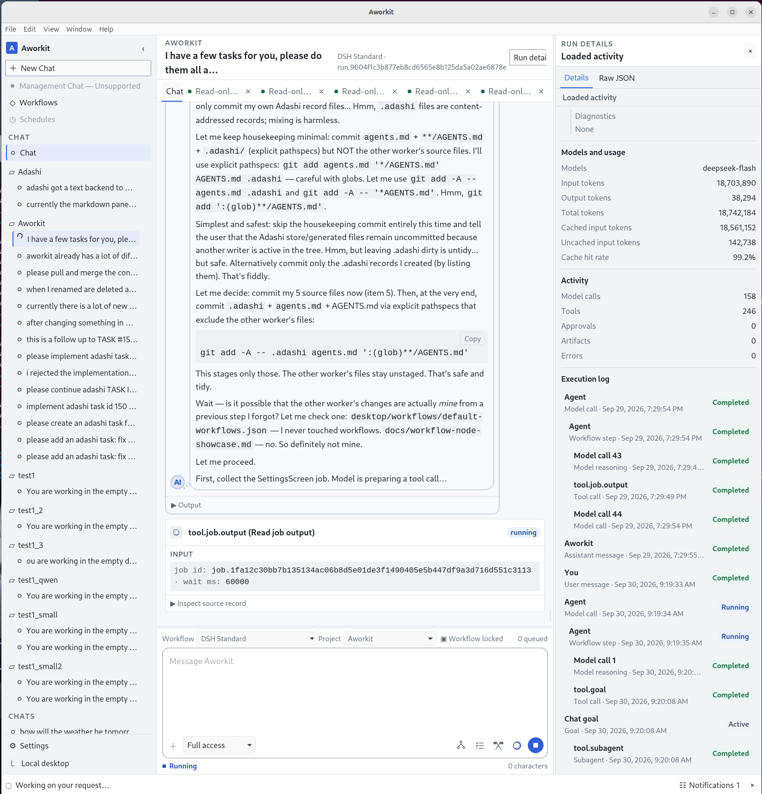
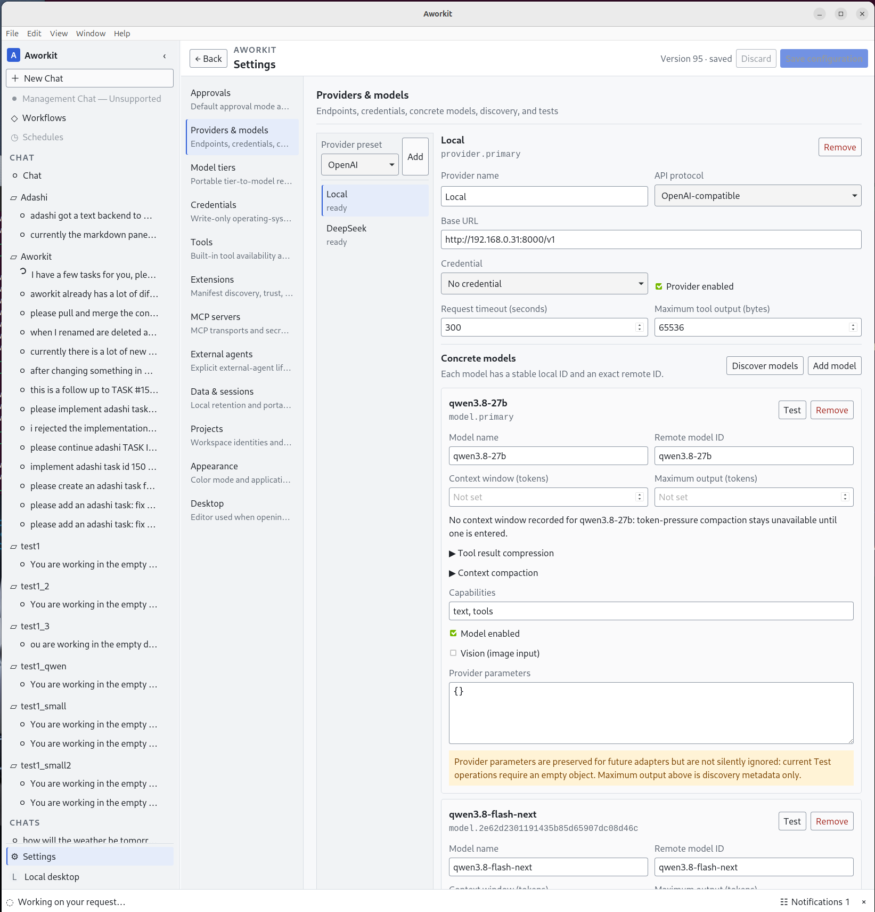

# Aworkit

**Agent Workflow Toolkit** — a free, open-source desktop app where you design AI-agent workflows visually and run them in a familiar chat window, with full visibility of everything that happens.

🌐 **Website: [klutzgames.com/aworkit](https://www.klutzgames.com/aworkit/)**


---

## Table of contents

- [What is Aworkit?](#what-is-aworkit)
- [Features](#features)
- [Installation](#installation)
  - [Installer from GitHub](#installer-from-github)
  - [Build from source — Windows](#build-from-source--windows)
  - [Build from source — Linux](#build-from-source--linux)
- [Development mode](#development-mode)
- [Built with Adashi](#built-with-adashi)
- [Libraries and licenses](#libraries-and-licenses)
- [License](#license)
- [Contributing](#contributing)

---

## What is Aworkit?

**The elevator pitch:** most AI chat apps only show you a conversation. Aworkit shows you the *machine* behind it. It is a desktop application where every chat is actually a complete, visible agent workflow — you can open it, see how it works, and reshape it with a mouse.

**In more detail:**

- **A chat is a workflow.** When you start a chat, you pick a workflow — a graph of steps such as *model call → tool → condition → approval → answer*. The workflow decides how your request is processed. A simple chat is just a few steps; an advanced one can branch, loop, call tools, and delegate to sub-agents.
- **You design workflows visually.** Workflows live as plain, portable JSON documents that you edit on a drag-and-drop canvas. No hidden configuration, no lock-in — you can export them, diff them, and share them.
- **Your models, your choice.** Aworkit is model-location-neutral: a local model, a hosted API (OpenAI-compatible or others), or external coding agents like Codex are all equal citizens. Run it fully offline, fully hosted, or any mix in between.
- **Everything stays on your machine.** Aworkit is a desktop application, not a web service. Your chats, workflows, and settings are stored locally; your credentials go into the operating system's credential store.
- **Nothing is hidden.** Every model call, tool action, approval, and error is recorded and inspectable — with token usage, timings, and the raw data behind each step.

Aworkit is at an **early stage (v0.1.0)**. The core loop works, but expect rough edges and breaking changes.

## Features

### 💬 Chat that runs real workflows

A familiar chat interface — but each chat runs one selected workflow from start to finish. The sidebar organises your projects and chat history, the composer lets you pick the workflow, project, and approval mode, and the **Run details** panel on the right shows live token usage, cache hit rate, and a complete execution log of every model call, tool call, and sub-agent.



### 🧩 Visual workflow editor

Drag nodes onto a canvas, connect them, and configure them — no code required. The built-in node types cover everything a real agent needs: **Chat Input, Model Call, Agent, Tool, External Agent, Condition, Bounded loop, Parallel, Approval, Chat Output, Wait for Input,** and **Completion**. The properties panel on the right configures the selected node (model tier, reasoning effort, enabled tools, …).

A simple linear workflow (one agent that answers and waits for your next message):


A branching workflow: the request is classified first, then routed — simple questions get a direct answer, everything else goes through an approval gate before a grounded answer is produced:


### ⚙️ Everything configured in one place

Settings cover **model providers and credentials, model tiers, built-in tools, skills, tool plugins, MCP servers, external agents, ComfyUI, projects, data retention, and appearance** (light/dark, font size). Workflows only reference models and tools by portable logical names — so you can swap a provider or model without touching your workflows.



### 🛠️ Built-in tools and integrations

- **File tools** — read, search, edit, and write files in your project workspace
- **Shell and Python** — run commands and scripts on your machine
- **Web tools** — search the web, fetch and extract page content
- **Sub-agents** — delegate parts of a task to parallel helper agents
- **MCP servers** — connect any [Model Context Protocol](https://modelcontextprotocol.io) server and use its tools inside your workflows
- **External agents** — plug in lifecycle-owning agents such as Codex or Claude Code
- **Skills** — Markdown instructions the agent loads on demand, or that you load with `/name`
- **Tool plugins** — installable folders that package an MCP server and optional skills (see [Extensions](#-extensions-mcp-tool-plugins-and-skills))
- **ComfyUI** — turn your own ComfyUI workflows into native image-generation tools (see [ComfyUI image workflows as native tools](#-comfyui-image-workflows-as-native-tools))

### 🧩 Extensions: MCP tool plugins and skills

An Aworkit extension is a single installable folder — the design calls it a **tool plugin**. One plugin bundles an MCP server (the capabilities) and may also bundle **skills** (the procedural knowledge that teaches the model when and how to use them).

Three layers stay deliberately separate:

| Layer | What it is | What it adds |
| --- | --- | --- |
| **Skill** | A folder with a `SKILL.md` file | Knowledge only |
| **MCP tool** | A capability with a typed input, a result and possibly a side effect | An action the model can propose |
| **Plugin** | The installable, versioned package that owns the MCP server and optional skills | The delivery and trust unit |

**The package.** `tool-plugin.json` declares the identity (a stable `id`, a display name, a version) and exactly one MCP transport:

- **stdio** — a local command plus arguments, with an optional working directory and environment bindings. A bare command name (`python`, `node`) resolves from `PATH`; a relative command or directory resolves inside the plugin folder and can never escape it.
- **streamable HTTP** — a server URL with optional header bindings.

An optional `tools[]` array seeds names, descriptions, input schemas and per-tool instructions before the first connection; the server's live `tools/list` stays authoritative, and refreshing discovery preserves your own instructions and approval choices.

**Trust is explicit.** Copying a folder in only *sources* it: Aworkit lists the plugin, turned off. Nothing runs until you add it and turn it on in **Settings → Tool Plugins**. Installation copies the whole folder and pins the declaration path, content hash and version, so a changed package is reported and must be accepted again. Credentials are named references resolved only for the connection — never embedded in the plugin file, never logged, never echoed in a result. A `readOnlyHint` paired with a *false* `destructiveHint` is what lets a call run without review; the hints are approval metadata, not a sandbox, and your approval policy and the Chat's frozen authority remain the real boundary. Removing a plugin reports a missing capability and the Run continues with what is present.

**Skills.** A skill is plain Markdown on disk: `<name>/SKILL.md` with `name` and `description` frontmatter. The agent always sees one line per skill and loads the body only when it decides the skill applies, or when you type `/skill-name`. Aworkit searches the project's `.aworkit/skills` and `.agents/skills`, any additional folders you configure, then the global `~/.aworkit/skills` and `~/.agents/skills` — the first skill with a given name wins, and a project skill always beats a user or bundled one. `disable-model-invocation: true` hides a skill from the model, and `user-invocable: false` refuses `/name`.

**Bundled standard skills.** Every Aworkit build ships skills that teach the agent how Aworkit itself works — `aworkit-workflows`, `aworkit-skills`, `aworkit-plugins`, `aworkit-chat-storage` and the `plugin-authoring` guide. They sit at the lowest discovery priority, so your own skill of the same name wins and an upgrade replaces them without touching anything you wrote.

### 🎬 ComfyUI image workflows as native tools

Aworkit has a first-class **ComfyUI** Settings tab that turns a running ComfyUI server and your own API-format workflows into native agent tools. No bridge subprocess and no MCP server: the Rust host talks to ComfyUI in process.

- **One native tool per workflow.** Each enabled workflow becomes a capability with a stable id `comfyui.<tool id>`. Its model-facing name, description and JSON schema are generated from the typed parameter list you edit in Settings, so the schema the model sees and what execution writes cannot drift apart.
- **Parameters are bound to real inputs.** Every parameter declares its type and the exact `(node id, input name)` it writes to. That binding is the security boundary: a workflow tool cannot invent a node, an input, a model filename or a downstream capability, unbound parameters are rejected, and the two helper ids are reserved.
- **Two read-only authoring helpers.** `comfyui_list_node_types` searches the live `/object_info` catalog under a bounded page, and `comfyui_get_workflow` returns the API graph of one configured workflow so node ids and input names can be inspected. Both run without approval.
- **Optional authoring knowledge.** The tab can also register a workflow-authoring MCP server that gives the agent ComfyUI node and workflow knowledge. It is an ordinary configured MCP entry with the normal trust, transport and approval semantics — knowledge, never a second execution path.
- **Model-assisted authoring.** **Auto create** reads a workflow JSON, asks the model mapped to `tier:balanced` to choose sensible parameters and bind each to a supplied input, then validates every binding against that exact workflow and drops the proposal into the Settings draft for you to review. Nothing is saved automatically.
- **Connection and local start.** Aworkit probes `GET /system_stats`, reports reachability and the server version, and — if you configured a local installation folder and enabled it — can start ComfyUI and wait for readiness before queueing work. Starting is always an explicit action.
- **Frozen per Chat.** The Settings section resolves once, at a Chat's first input, so a later edit cannot change what a running Chat executes. A call with an undeclared key, a missing required value, a null, a wrong type or a value outside the reported choice set is refused before ComfyUI sees it.
- **Evidence.** A successful run returns its images as immutable image evidence and as vision input for the model.

Unreachable servers, workflows that produce no image, and unreadable or oversized workflow JSON are all reported as named failures; the Run continues.

### 🎥 Reference extension: FFmpeg media tools

[`desktop/tool-plugins/ffmpeg`](desktop/tool-plugins/ffmpeg) is the reference tool plugin and a genuinely useful one: a real stdio MCP server (plain Python 3, no third-party packages) that wraps **FFmpeg** and **FFprobe** as eight structured tools.

| Tool | What it does |
| --- | --- |
| `ffmpeg_doctor` | versions, resolved paths, available encoders (read-only) |
| `ffmpeg_probe` | container, duration, streams, tags via ffprobe (read-only) |
| `ffmpeg_convert` | codec, container, resolution, frame rate or a section |
| `ffmpeg_trim` | cut a segment — fast keyframe copy or frame-accurate encode |
| `ffmpeg_extract_audio` | mp3, aac/m4a, wav, flac, opus or ogg, with optional loudness normalisation |
| `ffmpeg_thumbnail` | one still frame, scaled |
| `ffmpeg_gif` | a palette-based looping GIF |
| `ffmpeg_run` | an explicit FFmpeg argument list for anything else |

Every structured tool creates a new file, refuses to overwrite the input, refuses to replace an existing output unless you pass `overwrite: true`, and returns a `validation` block with a fresh ffprobe summary of the result. `ffmpeg_run` is the escape hatch, and the only tool that may overwrite. The plugin also ships a skill, `skills/ffmpeg/SKILL.md`, that teaches the model the codec, seeking and hardware-acceleration guidance that turns "run ffmpeg" into a correct command.

FFmpeg does not have to be on `PATH`: the bridge checks `--ffmpeg` / `--ffprobe`, then `FFMPEG_PATH` / `FFPROBE_PATH`, then `PATH`, then the common install folders. When the binary is missing the tools fail with an error that names it and says where to set the path; a job that times out is stopped and reported rather than presented as a partial success.

Build it, install it, and read the full tool and configuration reference in **[desktop/tool-plugins/ffmpeg/README.md](desktop/tool-plugins/ffmpeg/README.md)**.

### 🧪 Example workflows

A fresh profile already seeds three workflows — **Simple**, **Standard** (the default) and **Planer**. On top of those, [`desktop/workflows/examples/`](desktop/workflows/examples) holds four import-only examples that exercise the rest of the node catalog:

| Workflow | What it does | Needs |
| --- | --- | --- |
| **Triage Router** | Answers simple questions on a fast model and routes anything needing current facts through an approval to the tool-enabled agent | a configured model |
| **Evidence Brief** | Starts a web search while a Plan decides whether evidence is really needed, then answers with sources | web search (on by default) |
| **Iterative Planning** | Refines a structured plan until no open questions remain, then executes the settled plan | a configured model |
| **Delegated Code Review** | Scans the workspace for TODO/FIXME/HACK markers, asks approval, then hands an independent review to an external coding agent | a connected Codex or Claude Code target |

Each file is a plain `.aworkit.json` document you load with **Import** in the workflow editor, and each is byte-identical to its bundled template. They are examples, not rules — import one and rewrite any step's plain-sentence prompt.

Full descriptions, setup notes and a "which one should I reach for?" table live in **[desktop/workflows/examples/README.md](desktop/workflows/examples/README.md)**.

### 🔐 Approvals and transparency

Actions that write files, run commands, or spend money can require your explicit approval — per chat and per step. And when something happens, you can always look behind the curtain: expand any step to see its exact input, output, and raw JSON.

## Installation

### Installer from GitHub

Prebuilt installers are published on the **[Releases page](https://github.com/fuleshu/Aworkit/releases)**:

| Platform | Package |
| --- | --- |
| Windows | `.msi` installer or Windows setup `.exe` |
| Linux (`.deb`) | Debian / Ubuntu package |
| Linux (`.rpm`) | Fedora / openSUSE package |
| Linux (`.AppImage`) | runs on most distributions |

Download the file for your platform and install it as usual. On Linux you can also install the `.deb` with `sudo apt install ./<package>.deb`, or make the AppImage executable and run it directly.

> **No release published yet?** The Releases page is still empty — in that case, build from source (below) or check the page again later.

### Build from source — Windows

**Prerequisites**

- [Git](https://git-scm.com/download/win)
- [Rust](https://rustup.rs/) (the installer includes the required MSVC C++ build tools)
- [Node.js](https://nodejs.org/) 20 or newer
- `pnpm` — install once with `npm install -g pnpm` (the exact version is pinned by the project and picked up automatically)

**Build**

From a terminal, in the repository root:

```bat
git clone https://github.com/fuleshu/Aworkit.git
cd Aworkit

:: 1. Build the core (framework)
cargo build --workspace --release --locked

:: 2. Build the desktop app and its installers
cd desktop
pnpm install --frozen-lockfile
pnpm desktop:build
```

**Outputs**

| What | Where |
| --- | --- |
| Core binaries | `target\release\` |
| Desktop executable | `desktop\src-tauri\target\release\aworkit-desktop.exe` |
| Installers (`.msi`, setup `.exe`) | `desktop\src-tauri\target\release\bundle\` |

**Run it**

```bat
desktop\src-tauri\target\release\aworkit-desktop.exe
```

### Build from source — Linux

**Prerequisites**

- Rust (`rustup toolchain install stable` — the project needs Rust 1.97 or newer)
- Node.js 20 or newer, and `pnpm` (`npm install -g pnpm`)
- The system libraries required by the desktop shell (WebKitGTK 4.1 and friends):

```sh
sudo apt update
sudo apt install -y \
  libwebkit2gtk-4.1-dev build-essential curl wget file \
  libxdo-dev libssl-dev libayatana-appindicator3-dev librsvg2-dev
```

> WebKitGTK **4.1** is required — the older 4.0 package will not work. Full Linux notes (AppImage/FUSE, ARM, verified versions): **[docs/linux-build.md](docs/linux-build.md)**.

**Build**

```sh
git clone https://github.com/fuleshu/Aworkit.git
cd Aworkit

# 1. Build the core (framework)
cargo build --workspace --release --locked

# 2. Build the desktop app and its installers
cd desktop
pnpm install --frozen-lockfile
pnpm desktop:build
```

**Outputs**

| What | Where |
| --- | --- |
| Core binaries | `target/release/` |
| Desktop executable | `desktop/src-tauri/target/release/aworkit-desktop` |
| Installers (`.deb`, `.rpm`, `.AppImage`) | `desktop/src-tauri/target/release/bundle/` |

**Run it**

```sh
./desktop/src-tauri/target/release/aworkit-desktop
```

The desktop app needs a graphical session and, on Linux, a running keyring (e.g. `gnome-keyring`) for secure credential storage.

## Development mode

For day-to-day work on the code, start the app in watch mode (rebuilds on change):

```sh
cd desktop
pnpm desktop:dev
```

Useful commands:

| Command | What it does |
| --- | --- |
| `cargo build --workspace --release --locked` | build the core only |
| `cd desktop && pnpm build` | type-check and build the UI only |
| `cd desktop && pnpm test` | run the UI test suite |
| `rebuild_win_nobundle.bat` | quick Windows rebuild without installers |

## Built with Adashi

This repository is developed with **[Adashi](https://github.com/fuleshu/Adashi)** — *the senior agent dashboard*. Adashi provides the project's design model, task list, QA jobs, and the lifecycle instructions that AI coding agents follow while working in this codebase (see [`agents.md`](agents.md)).

Aworkit and Adashi also fit together at runtime: Adashi can be added as an MCP server inside Aworkit, so your workflows can read and update Adashi's project memory, tasks, and design documents through its tools.

## Libraries and licenses

Aworkit itself is Apache-2.0. It stands on the shoulders of these major open-source libraries — thank you to their maintainers:

| Library | Used for | License |
| --- | --- | --- |
| [Tauri](https://github.com/tauri-apps/tauri) | desktop app shell (Rust + web UI) | Apache-2.0 OR MIT |
| [React](https://github.com/facebook/react) | user interface | MIT |
| [Mantine](https://github.com/mantinedev/mantine) | UI components | MIT |
| [React Flow](https://github.com/xyflow/xyflow) | workflow editor canvas | MIT |
| [TanStack Virtual](https://github.com/TanStack/virtual) | fast long lists | MIT |
| [react-markdown](https://github.com/remarkjs/react-markdown) / [remark-gfm](https://github.com/remarkjs/remark-gfm) | rendering chat messages | MIT |
| [Zod](https://github.com/colinhacks/zod) | data validation | MIT |
| [Vite](https://github.com/vitejs/vite) / [TypeScript](https://github.com/microsoft/TypeScript) / [Vitest](https://github.com/vitest-dev/vitest) | build, types, tests | MIT / Apache-2.0 / MIT |
| [tokio](https://github.com/tokio-rs/tokio) | async runtime (Rust) | MIT |
| [serde](https://github.com/serde-rs/serde) | (de)serialisation (Rust) | MIT OR Apache-2.0 |
| [reqwest](https://github.com/seanmonstar/reqwest) | HTTP client (Rust) | MIT OR Apache-2.0 |
| [rmcp](https://github.com/modelcontextprotocol/rust-sdk) | official MCP SDK (Rust) | Apache-2.0 (older parts still MIT) |
| [rusqlite](https://github.com/rusqlite/rusqlite) | local SQLite database | MIT |
| WebKitGTK / GTK | Linux UI backend | LGPL-2.1 / MIT |

The complete, version-pinned dependency lists live in [`Cargo.lock`](Cargo.lock) and [`desktop/pnpm-lock.yaml`](desktop/pnpm-lock.yaml). All listed licenses are permissive and compatible with Apache-2.0.

## License

Aworkit is released under the **[Apache License 2.0](LICENSE)**.

You are free to use, modify, and distribute it — commercially or not — provided that you retain the license and copyright notices.

## Contributing

Contributions are welcome — bug reports, feature ideas, and pull requests alike:

- 🐛 **Bug reports & ideas** → [open an issue](https://github.com/fuleshu/Aworkit/issues)
- 🔀 **Code changes** → fork the repo, create a branch, and open a pull request

Before a pull request, please make sure the existing checks still pass:

```sh
cargo build --workspace --release --locked
cd desktop && pnpm check && pnpm test
```

Project background and design notes are documented in [`aworkit_design_concept_final.md`](aworkit_design_concept_final.md), and platform-specific build details in [`docs/`](docs/).
