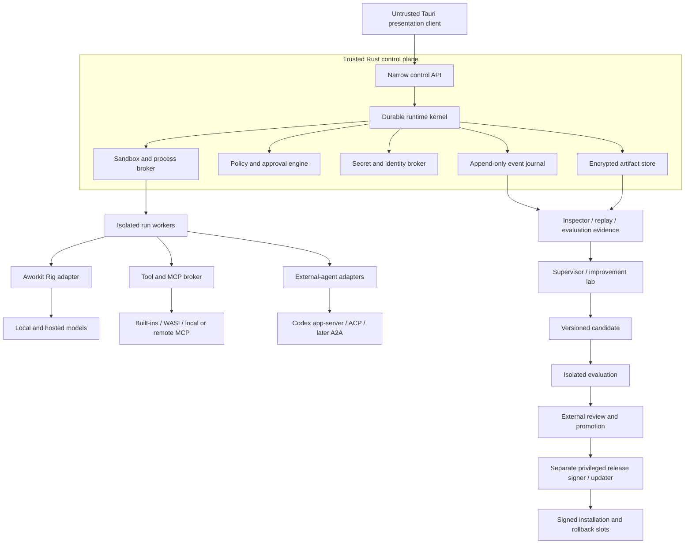

# Aworkit — Annotated Product Concept

**Expansion:** Agent Workflow Toolkit  
**Document status:** Researched concept, version 0.1  
**Research date:** 2026-08-19  
**Source:** `aworkit_design_concept.md`

This document preserves the ambition of the original brain dump while turning it into a product and architecture concept that can support production planning. Each `Axx` annotation records a material correction, extension, or decision. Citations point to primary documentation, repositories, specifications, or research papers listed under **Research sources**.

## Executive concept

> **Aworkit is a local-first, inspectable workbench and durable runtime for building, running, supervising, and evaluating agent workflows across models, tools, and external agents.**

Its differentiator is not merely a chat interface or node canvas. It is trustworthy execution: workflows are versioned and recoverable; every host-visible action has provenance; permissions are enforced outside the model; external capabilities are negotiated; and routing decisions are measured against real outcomes.

### Annotation A01 — Turn the feature collection into one product thesis

The original combines a desktop client, agent harness, workflow editor, router, plugin platform, external-agent host, and autonomous developer. Those pieces can belong together, but only if they share a clear center. The proposed center is the **durable, policy-enforced workflow runtime**. Chat, the canvas, routing, and supervision are views and services around that runtime.

### Annotation A02 — Start with a demanding, bounded market

The first production slice should serve individual developers and AI engineers running software-engineering and research workflows on local projects. They already need multiple models and tools, care about cost and traceability, and can judge whether a run succeeded. Shared, multi-operator team deployment requires a separate identity, authorization, synchronization, and conflict model and should follow after the single-operator runtime and safety model are proven. General personal-assistant automation can follow later.

## Product definition

### Problem

Current agent products commonly force users to choose among:

- convenient but opaque single-agent applications;
- flexible frameworks that require substantial application engineering;
- visual workflow builders without durable agent-runtime semantics; and
- powerful coding agents that cannot be composed under one portable policy, trace, and evaluation system.

Aworkit should let a user design or request a workflow, inspect its resolved execution plan, run it with controlled access to the machine and remote services, interrupt or approve consequential actions, recover after failures, and compare quality, cost, and latency across routing strategies.

### Primary personas

1. **Workflow author** — builds reusable agent workflows without writing an entire orchestration application.
2. **Technical operator** — runs, observes, interrupts, resumes, and audits workflows across projects.
3. **Platform engineer** — adds models, tools, policies, external-agent adapters, and organization controls.
4. **Evaluator** — maintains representative tasks, graders, baselines, and routing experiments.

The same person may fill all four roles in a local installation.

### Core jobs to be done

- “Run this goal across my project with the right models and tools, while keeping me in control of risky effects.”
- “Show me exactly what Aworkit supplied, selected, called, changed, and produced.”
- “Turn a successful run into a reusable, versioned workflow.”
- “Compare workflow and routing revisions using reproducible evidence rather than intuition.”
- “Delegate to Codex or another specialist without losing lifecycle control, policy, or provenance.”

### Value pillars

1. **Inspectable:** complete provenance for host-visible inputs, actions, decisions, approvals, results, and artifacts.
2. **Durable:** checkpointed runs survive application or worker failure and have explicit resume semantics.
3. **Safe by construction:** deterministic policy, capability scoping, approvals, and isolation sit outside model control.
4. **Composable:** typed workflows can use models, tools, subagents, and external agents through stable Aworkit contracts.
5. **Evidence-driven:** evaluation and routing telemetry are first-class product data.
6. **Local-first, not local-only:** projects and metadata can remain local while users opt into local or hosted models and services.

### Non-goals for the first production release

- A general consumer assistant for every domain.
- A shared multi-user workspace/server in the first production release.
- A public marketplace for unrestricted native plugins.
- Silent mutation of saved workflows during a run.
- Guaranteed access to a model’s private chain of thought.
- Autonomous promotion of self-authored application binaries.
- A single universal score that permanently ranks all models.

## Reference assessment

### Annotation A03 — Reuse lessons and licensed components, not another product’s identity

The original ChatShell link points to its agent library; the closer desktop reference is `chatshell-desktop`. Both are useful, but their current use of patched Rig components is also a coupling warning. Apache-2.0 distribution requires including the license and preserving or handling applicable notices; maintaining a license/notice inventory is recommended governance. Product name, logo, trade dress, and Aworkit’s own UX identity need separate review. This document therefore treats “look the same” as “retain the proven interaction patterns, then create an original accessible design system.” [R01](#r01) [R02](#r02) [R03](#r03)

| Reference | Adopt or study | Do not assume |
|---|---|---|
| ChatShell Desktop / Agent | Tauri-Rust integration, provider abstractions, conversations, streaming, tool UI, local persistence | That internal types are stable Aworkit contracts, or that license permission settles branding questions |
| Hermes Agent | Goal-directed loop, skills, memory patterns, subagents, scheduled work, local/cloud backends | That in-process permission checks are a security boundary; Hermes explicitly identifies OS isolation as the relevant boundary for adversarial models [R04](#r04) |
| DeepSeek Harness / Cordis | Scoped services, capability seams, reversible registration, ordered composition, append-only model-visible events | Production maturity; DeepSeek Harness is marked developer preview and Cordis is a young research direction [R05](#r05) [R06](#r06) |
| Rig | Rust-native providers, completion/embedding abstractions, tools, MCP helpers, streaming, tracing hooks | Durable scheduling, persistence, policy enforcement, or security isolation; isolate upstream churn behind Aworkit-owned adapters [R07](#r07) |
| ComfyUI | Direct manipulation of nodes, typed links, reusable graph files, separation of node definitions and instances | That an acyclic inference graph is enough for interrupts, loops, recovery, compensation, or side-effectful agents [R08](#r08) |
| Codex | Project/thread organization and isolated-worktree patterns [R41](#r41) [R42](#r42) | That UI imitation is an integration. Use App Server for the supported rich-client lifecycle, diffs, approvals, and streamed events, and negotiate/version-pin its capabilities [R09](#r09) [R10](#r10) |

## Product principles

1. **The journal is truth.** Model context, UI state, recovery, audit, and evaluation derive from canonical events and artifacts.
2. **The model proposes; the runtime disposes.** Models can suggest plans and actions, but deterministic components validate and authorize them.
3. **Freeze what ran.** Every run records an immutable base plan plus ordered immutable overlays, project source and dirty-state identity, relevant OS/runtime/toolchain and environment metadata, and hashes of policies, prompts, tool schemas and executables, plugins, router, and model capability snapshots.
4. **Capabilities, not ambient authority.** A component receives only the project paths, tools, credentials, network destinations, and budgets required for its current scope.
5. **Fail loudly at boundaries.** Unsupported cancellation, resume, tool passing, or schema behavior is reported; adapters do not silently degrade.
6. **Promote changes explicitly.** A successful run-local adaptation can become a new revision, never a hidden edit to the selected workflow.
7. **Measure cost per successful outcome.** Token price alone is not the product objective.
8. **Progressive disclosure.** A basic mode presents goals, plans, approvals, and results; an advanced mode exposes graphs, traces, policy, and routing evidence.

## System architecture

### Annotation A04 — Replace “everything is a plugin” with a trusted microkernel

Extensibility cannot include the mechanisms that constrain, identify, audit, or update extensions. A small Rust kernel must be non-replaceable at runtime and own the journal, scheduler, policy and approvals, secrets, sandbox/process broker, artifact integrity, plugin verification, and installed-version trust state. A separate privileged release signer/updater owns promotion-bound release signatures, atomic activation, and rollback slots. Higher-level agent loops, routers, workflow nodes, providers, and presentation modules can remain replaceable through versioned interfaces.

### Annotation A05 — Separate the control plane from untrusted execution

Treat the Tauri WebView as an untrusted presentation client. Tauri capabilities narrow WebView-to-Rust command access, but they are not an agent-execution sandbox. [R11](#r11) [R12](#r12) Aworkit therefore runs agent loops and tools in isolated workers or sidecars and constrains them with OS sandboxing, process containment, canonical filesystem roots, and egress rules.



### Component responsibilities

| Component | Owns | Must not own |
|---|---|---|
| Trusted kernel | Durable state transitions, event sequencing, policy, approvals, secret handles, sandbox launches, installed-version verification state | Model planning, release signing, activation, or user-interface rendering |
| Workflow compiler | Schema validation, graph validation, type checking, policy preflight, canonical serialization | Runtime authorization or hidden graph mutation |
| Run worker | Context compilation, agent loop, node execution, adapter calls | Long-term credentials, promotion authority, audit deletion |
| Provider gateway | Aworkit model request/event types, capability discovery, retries permitted by policy, usage normalization | Persistent domain objects tied to Rig/provider internals |
| Tool broker | Capability grants, schema validation, side-effect classification, timeouts, result envelopes | Deciding its own permissions |
| External-agent adapter | Lifecycle and capability negotiation, events, artifacts, cancellation, adapter-specific protocol | Pretending absent capabilities exist |
| Desktop UI | Authoring, monitoring, diffs, approvals, replay, evaluation views | Direct filesystem/process/network authority |
| Improvement lab | Candidate generation and experiments in isolation | Evaluator mutation, signing keys, release promotion, running-install changes |
| Release signer/updater | Promotion-bound release signature, activation manifest, atomic install, rollback slots | Candidate generation, evaluation criteria, or agent-controlled policy |

## Canonical product and execution model

### Annotation A06 — Define stable Aworkit domain objects before choosing framework types

Long-lived state must use Aworkit-owned, versioned schemas. Neither Rig run snapshots nor an external agent’s transcript should become the database contract: upstream formats can change and may contain sensitive provider payloads. Rig’s steppable `AgentRun` is useful as a version-pinned worker implementation or resumability cache, while the Aworkit event model remains canonical. [R13](#r13)

| Object | Meaning |
|---|---|
| Workspace | Local Aworkit environment, trust configuration, identities, and settings |
| Project | One or more authorized folders plus project instructions and policy overlays |
| Thread | User-facing conversation and goal history; can contain multiple runs |
| Goal | Desired outcome, constraints, acceptance criteria, and budgets |
| Run | One execution of an immutable resolved snapshot |
| Turn | One user/agent interaction boundary within a thread |
| Step / Attempt | Logical workflow operation and an individual execution attempt |
| Artifact | Immutable or versioned file, diff, report, dataset, trace attachment, or result |
| Workflow Definition / Revision | Editable source and an immutable published version |
| Resolved Run Snapshot | Immutable base plan plus ordered overlay hashes, project/source state, environment/toolchain identity, and configuration/capability hashes used by a run |
| Agent Profile | Role, instructions, allowed capabilities, context policy, and routing policy |
| Provider / Model Snapshot | Resolved identifier, capabilities, parameters, prices, limits, and health evidence |
| Tool / Plugin Manifest | Versioned schema, permissions, effects, platform support, and provenance |
| Policy Decision / Approval | Deterministic decision and any user authorization bound to an exact action |
| Evaluation Case / Result | Versioned input, graders, expected properties, evidence, and outcome |

All objects receive stable IDs. Events carry a run ID, causal parent, correlation ID, monotonic sequence, wall-clock time, schema version, producer identity, and integrity metadata. Large content is stored as content-addressed artifacts and referenced from immutable event envelopes; sensitive payloads are separately envelope-encrypted with keys held by the trusted broker. The snapshot also records the project revision and dirty-diff hash, tool executable and plugin digests, OS/architecture, relevant runtime/toolchain versions, and non-secret environment/configuration required to interpret the run.

## Workflow language and runtime

### Annotation A07 — Make the canvas a projection of a typed workflow language

ComfyUI demonstrates excellent visual authoring patterns, but Aworkit workflows are durable state machines rather than inference DAGs. Keep four representations distinct: the editor document, validated workflow definition, immutable compiled run plan, and live run state/event log. The canvas edits the first two; only the compiler creates the third; the runtime owns the fourth. ComfyUI itself uses a versioned workflow schema and typed connections, which are useful precedents. [R08](#r08) [R14](#r14)

### Workflow definition requirements

- Versioned JSON Schema with canonical serialization, stable IDs, migrations, and readable diffs.
- Semantic graph stored separately from layout, viewport, color, grouping, and comments.
- Typed data, control, artifact, and error ports.
- Nodes for model calls, tools, subagents, external agents, transforms, conditions, fan-out/join, waits, approvals, evaluators, and terminal results.
- Guarded cycles with iteration, recursion-depth, fan-out, token, time, and monetary limits.
- Explicit concurrency and join semantics.
- Step timeout, retry policy, fallback policy, cancellation behavior, and checkpoint policy.
- Side-effect metadata: read-only, idempotent write, non-idempotent, destructive, external communication, deployment, credential use.
- Idempotency keys and compensation where appropriate; non-idempotent effects are never retried implicitly.
- Static type, reachability, budget, capability, and policy validation before publication.
- Imports/subgraphs pinned by content digest, not mutable display name.

An illustrative source fragment:

```json
{
  "schema_version": "aworkit.workflow/1",
  "workflow_id": "software-change",
  "revision": 7,
  "inputs": { "goal": { "type": "string" } },
  "budgets": { "wall_time_s": 3600, "max_cost_usd": 8, "max_agent_depth": 3 },
  "nodes": [
    {
      "id": "implement",
      "kind": "agent",
      "profile": "coding-agent",
      "routing_policy": "balanced-coding",
      "capabilities": ["project.read", "project.patch", "process.test"],
      "timeout_s": 1800
    },
    {
      "id": "review",
      "kind": "evaluator",
      "requires": ["tests", "diff"],
      "on_failure": { "goto": "implement", "max_iterations": 2 }
    }
  ],
  "edges": [{ "from": "implement.result", "to": "review.candidate" }]
}
```

This is illustrative rather than the final schema; the schema should be designed from representative workflows and conformance tests.

### Annotation A08 — Bound dynamic adaptation instead of mutating the selected workflow

Unrestricted live graph mutation defeats inspection, replay, approval, and meaningful workflow selection. Each run therefore pins an immutable base plan. An agent may create a private task plan or propose a **run-local plan overlay** at an explicit safe point. The compiler validates the overlay, computes a diff, checks policy and budgets, and journals it before execution. Every accepted overlay is immutable, ordered, and hashed; the effective plan is the base plus that recorded sequence. It does not modify the saved workflow. A persistent improvement is a new revision promoted explicitly after evaluation.

### Runtime state machine

A run progresses through explicit states such as:

`created → resolving → awaiting_approval → runnable → running → interrupted → running → succeeded | failed | cancelled`

Each step has attempts with its own lifecycle. The kernel records the intent event before dispatch and records a terminal result or an explicit unknown-outcome state after disruption. Recovery replays durable events, reconciles leases and child processes, and resumes only operations whose contracts permit it. Cancellation is requested and tracked end-to-end; local child-agent/process trees are forcibly cleaned up, while unsupported or unconfirmed remote cancellation remains visibly `cancelling` or `unknown_outcome` until reconciliation.

The runtime must support:

- durable checkpoints and leases;
- interrupt/resume and human-input nodes;
- bounded parallel branches and deterministic joins;
- explicit partial failure and compensation;
- per-run emergency stop and global execution pause;
- backpressure for event streams and tool output;
- artifact size and retention policies; and
- crash/fault injection tests for every state transition.

## Agent and model layer

### Annotation A09 — Use Rig as a replaceable engine behind Aworkit contracts

Rig is a strong Rust foundation for provider-neutral completion, streaming, tools, MCP integration, and agent execution. It also exposes runtime model-selection seams. Aworkit should use those facilities rather than fork provider switching, but wrap them in an object-safe adapter and persist only Aworkit request, event, usage, and error types. Version-pin Rig, run adapter conformance tests, and treat its snapshots as sensitive, version-specific worker state. [R07](#r07) [R13](#r13) [R15](#r15)

### Agent profile

An agent profile is not merely a prompt plus model tier. It declares:

- purpose and instructions with provenance;
- input and result schemas;
- allowed tool and delegation capabilities;
- context selection and compression policy;
- routing policy and eligible provider/model set;
- iteration, delegation, cost, token, and wall-time budgets;
- verification and stopping rules;
- workspace and data-classification constraints; and
- fallback, cancellation, and failure behavior.

The agent loop is steppable and event-driven. Provider retries are distinct from switching providers. Concurrent read-only tools may run in parallel, but their results are correlated and reintegrated deterministically. Compression must preserve tool-call/result pairing and record exactly which host-visible context was replaced by which summary artifact.

### Context compiler and memory

The runtime—not an opaque prompt template—compiles each model request from versioned instruction layers, the goal and current step, selected thread history, authorized project artifacts, explicit memory entries, tool schemas, budgets, and prior results. It writes a request manifest that records every included item, its source and scope, any transformation or summary, the inclusion reason, token contribution, and redaction. The inspector renders the same manifest.

Persistent memory is an explicit domain object/artifact, not hidden context. Each entry carries its author, provenance, scope (`thread`, `project`, or local user), creation and validation times, confidence/status, access policy, expiry/invalidation rules, and links to supporting evidence. Memory creation and mutation are journaled policy decisions; every retrieval used in a request is visible. Deletion follows the encrypted-payload/tombstone model, and stale or contradicted memory remains traceable without silently entering future context.

### Annotation A10 — Replace absolute model tiers with capability-aware service profiles

“Intelligence,” speed, and cost are not stable universal scalars. Performance varies by task, language, modality, context length, tool use, provider availability, and model revision. Present user-facing service profiles such as `quality`, `balanced`, `economy`, and `local-private`; resolve each profile against a live, versioned capability catalog. A domain label such as `frontend` belongs in an agent or workload profile, not on the same axis as speed and quality.

The catalog should record at least:

- provider and immutable model/revision identifiers where available;
- modalities, context/output limits, structured-output and tool capabilities;
- reasoning controls and observable reasoning format;
- locality, privacy, region, and data-retention constraints;
- measured latency, availability, rate limits, and price snapshot;
- workload-specific evaluation results and uncertainty; and
- last validation time and known compatibility exceptions.

## Routing architecture

### Annotation A11 — Use hierarchical, trajectory-aware routing rather than classification alone

The proposed task dimensions are valuable features, but a one-off LLM classification is not a sufficient router. RouteLLM and FrugalGPT show useful preference-based routing and cascade strategies, while newer software-engineering research finds that the initial prompt can lack the information required to choose well; cheap exploration followed by trajectory-aware escalation can improve the decision. The router should combine hard eligibility constraints, deterministic policy, learned workload evidence, verification, and feedback. [R16](#r16) [R17](#r17) [R18](#r18) [R19](#r19) [R20](#r20)

Routing occurs at three separate levels:

1. **Execution strategy / agent profile:** choose, for example, direct answer, retrieval-first, plan-and-execute, coding agent, or parallel research and synthesis.
2. **Model per step:** select a model from candidates eligible for that agent and operation.
3. **Trajectory decision:** continue, verify independently, retry safely, switch provider, escalate capability, ask the user, or stop.

### Decision pipeline

1. **Eligibility filter:** remove candidates that violate locality, privacy, data-region, modality, context, structured-output, tool, credential, quota, health, or organization constraints.
2. **Deterministic policy:** apply the selected service profile, user overrides, maximum cost/latency, required verification, and forbidden fallback destinations.
3. **Feature extraction:** classify the task and use observable runtime evidence, not only the initial prompt.
4. **Outcome estimation:** predict probability of success, cost, latency, and uncertainty for eligible candidates using workload-specific evaluation data.
5. **Utility / constraint decision:** optimize the workflow’s explicit objective, such as best verified result under a budget or lowest expected cost above a quality floor.
6. **Execution policy:** define cascade, fallback, independent verifier, and escalation thresholds.
7. **Feedback:** record observed utility, selection propensity, failures, user correction, and drift signals for offline evaluation and later router revisions. True route regret is counterfactual; estimate it only from benchmark outcomes for alternatives, shadow execution, or a documented off-policy estimator.

Risk is not simply a reason to choose a larger model. It can require stronger isolation, narrower capabilities, an independent verifier, or a human approval. When the router is uncertain or lacks representative evidence, it must fall back to a documented deterministic policy.

An illustrative routing input is:

```json
{
  "task": {
    "family": "coding",
    "domain": ["rust", "desktop_security"],
    "scope": "repository_wide",
    "reasoning_depth": "high",
    "ambiguity": "medium"
  },
  "operations": ["read", "edit", "execute_tests"],
  "effects": {
    "risk": "high",
    "reversibility": "partial",
    "external_side_effects": false
  },
  "verification": {
    "available": ["compile", "unit_tests", "policy_tests"],
    "independent_review_required": true
  },
  "constraints": {
    "data_locality": "local_or_zero_retention",
    "max_cost_usd": 4,
    "deadline_ms": 900000,
    "required_capabilities": ["tool_calling", "long_context"]
  },
  "trajectory": {
    "attempt": 1,
    "tests_failed": 2,
    "uncertainty": 0.31
  }
}
```

The output includes the eligible candidates, rejected candidates and reasons, selected strategy/model, policy and scorer versions, confidence, predicted outcomes, fallback/escalation plan, and later actual outcome.

### Router development discipline

- Start with transparent deterministic rules and representative evaluation suites.
- Add learned scoring only when it beats simple baselines on a development validation set with confidence intervals, then confirm it on the sealed suite only at promotion.
- Use shadow routing and counterfactual logging before activating a revision.
- Evaluate quality, cost per success, latency, calibration, failure severity, and estimated route regret—not classifier accuracy alone.
- Segment by workload and track provider/model drift; never extrapolate one benchmark into a universal ranking.
- Keep evaluation cases, outcomes, and router versions immutable and independently reviewable.
- Keep transparent simple policies as the production baseline until a learned router demonstrates a robust improvement. The learned scorer may never relax privacy, safety, capability, or organization constraints; router benchmarks and robustness research show that complex routers can fail to beat simple baselines and can route adversarial inputs toward weaker models. [R46](#r46) [R47](#r47)

## External agents and protocol boundaries

### Annotation A12 — Treat external agents as lifecycle-managed principals, not tools with a prompt

MCP standardizes client-server capability exchange, but its core does not define a universal external-agent lifecycle or delegation contract. [R43](#r43) An external agent may not accept arbitrary passed-through MCP configuration or credentials. The referenced `dsh-subagent-codex` package demonstrates useful one-shot delegation, but not continuation, full event capture, approval brokerage, timeout, usage, or protocol compatibility. Aworkit therefore needs an explicit external-agent adapter contract. [R21](#r21) [R22](#r22)

Every adapter negotiates and records:

- protocol and schema versions;
- session/thread creation, continuation, resume, and fork support;
- workspace and isolation model;
- accepted instructions, tools, MCP servers, and dynamic capabilities;
- streaming event and artifact types;
- permission and human-input requests;
- result schema, usage, cost, and error reporting;
- cancellation, timeout, crash, and orphan cleanup behavior;
- authentication and credential boundaries; and
- provenance and retention behavior.

The common Aworkit delegation envelope carries a task, project roots, policy profile, granted capabilities, budgets, desired result schema, trace context, cancellation token, and artifact channel. Unsupported required capabilities cause a clear preflight failure.

### Protocol roles

- **MCP:** broker server capabilities such as tools and resources without treating the server as a child-agent lifecycle. Maintain protocol-version adapters; the 2026-07-28 specification moved core operation toward stateless requests and explicit discovery, so workflow correctness must not depend on an assumed MCP session model. Treat tool annotations and remote output as untrusted. [R23](#r23) [R24](#r24) [R43](#r43)
- **Codex App Server:** preferred rich Codex integration. It exposes initialization, thread/turn/item lifecycle, streamed events, approvals, and generated schemas tied to the installed Codex version. Aworkit should launch a controlled profile, pin/validate schemas, broker approvals, and avoid depending on experimental fields without explicit gating. [R09](#r09) [R10](#r10)
- **ACP:** standardized local coding-agent/client lifecycle where an agent supports it, including initialization, sessions, prompts, cancellation, permissions, files, and terminals. [R25](#r25)
- **A2A:** a later option for remote, opaque agent services; do not put it on the critical path for the local-first MVP. [R26](#r26)

## Tools and plugins

### Annotation A13 — Make scope, authority, and isolation separate concepts

DeepSeek’s scoped service overlays are useful for visibility and lifetime, but its own scope contract is not a sandbox. An Aworkit scope determines what a component can discover; a capability grant determines what it may request; policy decides what is allowed now; the OS or WASM runtime enforces isolation. All four are required. [R05](#r05) [R27](#r27)

### Trust tiers

1. **Built-in audited Rust capability** — shipped and signed with Aworkit, still constrained by policy.
2. **WASM component plugin** — explicit host functions, filesystem preopens, network policy, memory/fuel/time limits; useful defense-in-depth rather than a perfect boundary.
3. **Signed native sidecar or local MCP server** — separate identity and process, OS-sandboxed, narrow IPC and credential grants.
4. **Remote MCP/service** — untrusted network principal with explicit authentication, egress, data, and retention policy.

The trusted kernel, policy/approval engine, secret broker, audit journal, plugin verification, and updater cannot be replaced by plugins.

### Tool/plugin manifest

Each version declares:

- publisher, provenance, digest, signature, license, and compatibility range;
- input/output/error JSON Schemas and schema versions;
- permissions and capability scopes;
- effect class, reversibility, idempotency, and typed non-authoritative preview metadata; the trusted UI renders canonical arguments, diffs, destinations, data, and credential scope for approval;
- supported OS/architecture matrix and capability probes;
- subprocess, filesystem, network, credential, and data-classification needs;
- time, memory, output-size, and cost limits;
- cancellation and cleanup contract; and
- conformance and integration test evidence.

“100% ensured on every OS” is not an achievable engineering promise. The production contract is an explicit support matrix, hermetic unit/contract tests, CI on every supported platform, real integration tests, capability probing at runtime, signed artifacts, and documented unsupported cases. Windows, macOS, and Linux implementations may differ behind one semantic contract.

## Security and governance

### Annotation A14 — Put deterministic controls outside every model, including the supervisor

Prompt injection, confused-deputy behavior, excessive agency, credential leakage, and supply-chain compromise are foundational threats, not edge cases. Instructions in files, websites, tool results, plugins, and child-agent output are untrusted data. No model—including the most capable one—may grant itself authority, weaken logging, change promotion criteria, or access raw credentials. Hermes’ security documentation similarly warns that in-process allowlists are heuristic and that OS-level isolation is the relevant boundary for adversarial model behavior. [R04](#r04) [R28](#r28) [R29](#r29)

### Required controls

- A default-deny capability and egress model, with separate identities for users, runs, workers, plugins, and remote services.
- A secret broker that returns scoped handles or short-lived credentials; secrets never enter prompts, ordinary events, logs, crash reports, or plugin configuration.
- Canonical path validation, workspace-root and symlink checks, structured process arguments, and no string-built shell authority.
- Data classification propagated through artifacts and model/tool eligibility decisions.
- Exact approval binding: changing command arguments, patch/diff, destination, credential scope, or data selection invalidates approval.
- Risk previews that show the concrete effect and offer narrowly scoped, expiring grants to avoid approval fatigue.
- Hard budgets for recursion, fan-out, tokens, cost, wall time, processes, storage, and network transfer.
- Signed packages and updates, dependency inventory/SBOM, build provenance, revocation, atomic activation, and rollback. Tauri’s updater requires signed update artifacts and should be controlled outside agent workers. [R30](#r30)
- Emergency stop, process-tree cleanup, tamper-evident audit events, retention/deletion controls, and export.
- Adversarial tests for indirect prompt injection, tool-output injection, data exfiltration, approval spoofing, path escapes, and plugin compromise.

## Runtime transparency and observability

### Annotation A15 — Promise complete provenance, not access to private chain of thought

Aworkit can expose everything it constructs or observes. It cannot guarantee access to a provider’s hidden system prompts, private reasoning, opaque compaction, or internal execution. The UI must label `reasoning_summary`, `provider_reasoning`, `opaque_reasoning`, and ordinary output distinctly and must never present a summary as raw chain of thought. Codex, for example, streams raw reasoning text only when the model supports it. [R09](#r09)

The inspector should show:

- the resolved run manifest and hashes;
- visible prompt/context layers with source, inclusion reason, transformations, and redactions;
- candidate routes, constraint rejections, scores, policy decisions, and selected fallback plan;
- model, tool, and child-agent lifecycle events;
- exact approval requests and responses;
- file diffs, commands, network destinations, artifacts, and verification results;
- retries, fallbacks, compression, cancellation, and recovery transitions; and
- tokens, cost, latency, provider health, and evaluation outcomes.

Use one canonical append-only event journal plus separately encrypted, content-addressed artifact payloads. The UI, debugger, and offline evaluator consume that model. In **full-record mode**, encrypted canonical local records retain the Aworkit-controlled model and tool content needed for exact reconstruction. A **metadata-only mode** deliberately omits content and must display that exact replay is unavailable. Telemetry export is a separate concern: export normalized metadata through an OpenTelemetry adapter because the GenAI agent conventions remain evolving, and make exported raw prompt, response, reasoning, and tool content opt-in, redacted, encrypted, access-controlled, and retention-limited. [R31](#r31)

Append-only integrity applies to non-sensitive event envelopes. Deletion leaves a tombstone and integrity metadata while separately stored payloads and artifacts are erased; destroying their envelope-encryption keys provides crypto-shredding where physical deletion cannot be proven. The inspector must disclose resulting replay gaps.

Replay means reconstructing the resolved context, decisions, actions, and recorded results. It does not imply silently re-executing side effects or guaranteeing identical stochastic model output.

## Supervisor and improvement lab

### Annotation A16 — Convert autonomous self-rewriting into gated, evidence-producing improvement

The supervisor is valuable as an investigator, author, and experiment orchestrator. Giving the same agent authority to edit its code, change its evaluator, compile, replace the installed binary, and restart itself is uncontrolled privilege escalation. A highly capable model is not a trust boundary, and optimization systems can exploit weak metrics. Research on self-improving agents is promising; taken together, these results motivate Aworkit’s requirement for held-out evaluation and external governance. [R32](#r32) [R33](#r33) [R34](#r34) [R35](#r35)

The supervisor may:

- inspect the journal, artifacts, failures, costs, and evaluation results permitted by its policy;
- explain root causes and propose workflow, prompt, router, tool, policy, or code revisions;
- generate a new workflow revision from a natural-language request;
- launch bounded experiments against immutable development evaluation suites and submit candidates to a sealed, query-limited holdout service;
- prepare reviewable diffs, migration plans, and release notes; and
- recommend promotion or rollback with evidence.

It may not:

- reveal or retrieve raw secret values;
- modify, select, or directly inspect sealed holdout cases, or query them outside the evaluation service’s policy;
- change audit, policy, signing, promotion, or rollback enforcement;
- write to the running installation or updater;
- authorize its own consequential actions; or
- silently promote a candidate because its own grader approves it.

### Candidate pipeline

1. Create an isolated, disposable worktree or source snapshot with a fresh run identity.
2. Do not mount production credentials, signing keys, promotion controls, or sealed holdout definitions; deny the candidate access to them.
3. Generate a candidate change with a complete diff and dependency/provenance record.
4. Run formatting, static checks, unit/contract/integration tests, security tests, native-OS matrices, and representative development evaluations.
5. Compare against an immutable development baseline, then use a sealed final holdout with a strict query budget and policy-approved aggregate results. Combine deterministic graders, calibrated model judges where appropriate, and human review for product/policy judgment.
6. Produce a candidate build and SBOM with signed provenance/attestation under a non-release identity.
7. Require explicit human or externally defined deployment-policy approval cryptographically bound to the candidate digest.
8. Let a separate promotion service apply the release signature and activation manifest only after approval; then activate atomically through the privileged updater, canary the revision, monitor hard rollback triggers, and retain the last known-good version.

Router experimentation can be highly autonomous inside this lab: generate rule/scorer candidates, run replay and development benchmark suites, calculate confidence intervals and Pareto frontiers, and prepare a recommendation. The sealed holdout has a strict query budget so repeated aggregate scores cannot become an adaptive training signal. Evaluation definitions and promotion remain outside the candidate’s authority.

## Desktop experience

### Annotation A17 — Design one approachable product with an expert inspection layer

The original UI requirements—projects, multiple chats, font-size controls, and light/dark themes—are necessary but not differentiating. The interface must make a complex runtime understandable without hiding consequential behavior. Basic and advanced modes should use the same underlying data rather than separate products.

### Primary surfaces

1. **Projects and threads** — folder-scoped projects, search, archive, recent runs, status, budgets, and isolated-worktree choices.
2. **Goal/run view** — conversation, current plan, active steps, artifact previews, cost/time meter, pause/cancel, clarification, and exact action approvals.
3. **Workflow Studio** — form and canvas views, templates, subgraphs, validation, revision history, diffs, test cases, and publish/promotion flow.
4. **Inspector** — chronological and graph views over context provenance, routing, model/tool/subagent events, policy decisions, retries, recovery, artifacts, and usage.
5. **Registry and Policy** — models, agent profiles, tools, plugins, external agents, capabilities, credentials, trust state, health, and scoped policy.
6. **Evaluation Lab** — datasets, graders, baselines, experiment comparisons, failure clusters, quality/cost/latency Pareto plots, drift, and promotion decisions.
7. **Settings** — theme, density, font size, reduced motion, data retention, telemetry, providers, updates, and accessibility.

The default run view answers five questions immediately: What is the goal? What is happening now? What authority is in use? What needs my decision? What evidence supports the result? Advanced details expand in place.

Accessibility is a release requirement: keyboard-complete operation, visible focus, semantic labels, sufficient contrast, scalable typography without clipped layouts, status not conveyed by color alone, reduced motion, screen-reader announcements for streaming and approvals, and WCAG 2.2 AA testing. [R36](#r36)

### Local data and privacy

- Use an embedded transactional database for metadata and the append-only event journal, plus a content-addressed artifact store for large data.
- Treat encryption and secure key storage as supported-platform prerequisites. If they are unavailable, fail closed for sensitive projects or require an explicit reduced-security mode that disables sensitive-content capture.
- Store credential references, never plaintext provider secrets, in ordinary configuration.
- Allow per-project retention, export, redaction, deletion, and telemetry policies; add organization policy when multi-user deployment exists.
- Make remote transmission visible at the point of configuration and action; route data only to eligible providers and services.
- Make full-record versus metadata-only local capture explicit; metadata-only mode forfeits exact replay. Configure exported telemetry independently and keep it metadata-only by default.
- Preserve immutable non-sensitive event envelopes and deletion tombstones while erasing separately encrypted payloads/artifacts and crypto-shredding their keys. “Append-only” must not make privacy obligations impossible.
- Provide backup, migration, corruption recovery, and explicit backward- and forward-compatibility guarantees for readers, writers, and migrations before calling the runtime production-ready.

## Delivery strategy

### Annotation A18 — Stage the frontier features behind a production foundation

Trying to ship the full canvas, marketplace, learned router, universal agent interoperability, and autonomous improvement together would obscure whether the kernel is reliable. The sequence below proves the differentiator early while keeping the long-term architecture open.

### Phase 0 — Product, contracts, and safety foundation

- Select three to five representative software/research workflows and explicit non-goals.
- Write workflow, event, policy, approval, adapter, plugin, and artifact schemas with compatibility rules.
- Threat-model local files/processes, remote providers, MCP, plugins, prompt injection, external agents, updates, and telemetry.
- Create the license/notice/source-provenance inventory; reimplement rather than copy GPL-covered ComfyUI backend or frontend code unless the product’s licensing strategy deliberately supports it. [R37](#r37) [R44](#r44)
- Build evaluation cases and native Windows/macOS/Linux CI before router optimization.
- Spike and contract-test Rig, Codex App Server, MCP, sandbox/process control, crash recovery, and Tauri IPC.
- Decide the initial product license, business model, supported platforms/architectures, data posture, and Aworkit brand/trademark/domain clearance.

**Exit gate:** reviewed contracts and threat model; representative end-to-end spike; reliable native CI; initial evaluation baseline; no unresolved architecture blocker in the trusted kernel.

### Phase 1 — Production-capable MVP

- Projects, threads, goal/run UI, streaming, pause/cancel, diffs, approvals, and inspector.
- Trusted Rust kernel, journal, artifact storage, durable run/step state, checkpoints, and recovery.
- Rig-backed provider gateway with representative hosted and local models plus a capability catalog.
- A bounded agent loop and built-in read/search/patch/process/test tools with sandbox and policy enforcement.
- MCP client/broker with scoped authentication and version compatibility.
- Versioned declarative workflows supporting sequence, condition, fan-out/join, approval, and evaluator loop; form editor plus read-only graph visualization.
- Deterministic `quality`, `balanced`, `economy`, and `local-private` routing policies.
- Offline regression runner, trace export, privacy/retention controls, signed updates, and rollback.
- One experimental Codex App Server adapter if external coding-agent composition is required to prove differentiation.

**Explicit deferrals:** unrestricted native plugins, learned routing, arbitrary live graph mutation, broad external-agent matrix, and self-promotion.

### Phase 2 — Workflow and extension platform

- Full visual Workflow Studio and compiler, reusable subgraphs, testing, and revision promotion.
- Isolated subagents and bounded run-local overlays.
- Plugin SDK, WASM components, signed registry, trust tiers, and enterprise policy controls.
- Organization/user/service identities, roles, membership, ownership/ACLs, shared-workspace synchronization, and multi-operator conflict handling before team deployment.
- ACP adapters, headless/CLI runtime, and additional external-agent conformance suites.

### Phase 3 — Evaluation-driven adaptive routing

- Learned workload-specific outcome models.
- Shadow and counterfactual routing, calibrated uncertainty, pairwise user feedback, and drift monitoring.
- A/B and canary router rollout with automatic safety and quality rollback triggers.
- Cost-per-success, quality, latency, estimated-regret, and Pareto dashboards.

### Phase 4 — Gated improvement lab

- Isolated configuration, workflow, router, prompt, tool, and code candidates.
- Immutable, sealed, query-limited held-out evaluations.
- Trusted build/signing/promotion service, candidate provenance, canaries, and automatic rollback.
- Increasing autonomy only where repeated evidence supports a narrowly defined policy.

## Initial quality-gate categories and provisional targets

The final values must be calibrated and frozen against named reference hardware, OS versions, workload datasets, and concurrency profiles before implementation exits Phase 0. The following are provisional contracts and required measurement categories:

- **Traceability:** every host-visible model, tool, route, policy, approval, configuration, and artifact operation has correlation IDs and frozen version hashes.
- **Context provenance:** in full-record mode, every host-injected model input can be reconstructed from encrypted records and artifacts, subject to explicit secret handling; metadata-only mode is visibly non-replayable.
- **Policy safety:** zero hard-policy violations in conformance and adversarial suites.
- **Approval binding:** any change to arguments, diff, destination, data, or credential scope invalidates the approval.
- **Durability:** zero lost or corrupted committed events across at least 10,000 fault-injected reference runs; every in-flight effect recovers to a defined state.
- **Cancellation:** local cancellation completes below two seconds at p95 on reference hardware with no orphaned local process tree; unsupported remote cancellation remains visible and reconciled rather than reported as complete.
- **Side effects:** no implicit retry of a non-idempotent operation.
- **Cross-platform evidence:** name the exact launch matrix before scope freeze; the provisional minimum is Windows 11 x64, current and previous macOS on arm64, and Ubuntu LTS x64. All mandatory conformance cases pass on that matrix; deviations are explicit capability results.
- **Secrets:** no plaintext credentials in the database, journal, artifacts, logs, traces, or crash reports.
- **Updates:** only artifacts whose release signature and activation manifest are bound to an approved digest may activate; rollback is tested, not merely documented. SLSA provenance is a useful supply-chain reference. [R38](#r38)
- **Routing:** before learned-router work, freeze the baseline, non-inferiority margin, cost-reduction target, 95% confidence method, and router latency/cost ceiling. A learned router ships only if it satisfies all of them on the sealed suite; report estimated regret only when the experiment supplies valid counterfactual evidence.
- **Evaluation integrity:** model judges must be calibrated against humans, tested for order/position bias, and combined with deterministic evidence where possible; sealed-holdout queries and disclosures are budgeted and audited. [R39](#r39) [R40](#r40) [R45](#r45)
- **Self-improvement containment:** candidates cannot modify evaluators, held-out cases, signing keys, promotion rules, rollback controls, or the running installation.
- **Production SLO envelope:** before Phase 1 release, set and load-test recovery-time objectives, maximum journal/artifact volume, workflow node/edge size, concurrent runs/steps, event backpressure, UI streaming responsiveness, and idle/active CPU-memory overhead on reference hardware.

### Product outcome metrics

- Verified task-success rate by workflow and risk class.
- Median time and total cost per successful outcome versus the agreed single-agent baseline.
- Time to first successful workflow and workflow reuse rate.
- Human intervention, clarification, approval, cancellation, and override rates, segmented by cause.
- Median time to diagnose a failed run using the inspector.
- User-reported trust and comprehension for plans, permissions, routing explanations, and result evidence.

## Principal risks and mitigations

| Risk | Primary mitigation |
|---|---|
| Indirect prompt/tool-output injection | Provenance labels plus deterministic capabilities, policy, isolation, and egress control |
| Plugin/tool supply-chain compromise | Signatures, provenance, SBOM, trust store, revocation, sandbox, least privilege |
| Shell/path injection | Structured arguments, canonical roots, symlink checks, no string-built command authority |
| Secret or project-data exfiltration | Secret handles, data classification, eligible-provider filtering, scoped egress |
| Runaway delegation or spend | Hard depth/fan-out/token/time/cost/process limits and global stop |
| Approval fatigue or spoofing | Exact previews, risk-based prompts, bound and expiring grants |
| Provider/model drift | Versioned capability snapshots, health checks, canaries, explicit fallback, re-evaluation |
| External-agent mismatch | Capability negotiation, adapter conformance, timeouts, cancellation and cleanup tests |
| Evaluator gaming | Independent deterministic checks, inaccessible held-out cases, multiple graders, human audits |
| WebView compromise | Strict CSP and Tauri capabilities; no privileged remote content; brokered IPC |
| Sensitive journal growth | Encryption, access control, redaction, retention, export/deletion, artifact separation |
| Upstream framework churn | Pinned versions, thin adapters, fork policy, Aworkit-owned persistent contracts |
| Raw-reasoning misrepresentation | Provider-dependent labels; never promise or infer hidden chain of thought |
| Update/recovery failure | Separate signed updater, atomic activation, last-known-good rollback, fault tests |

## Open product decisions

1. Which three to five workflows define the initial benchmark and sales story?
2. Is the first buyer an individual developer, an AI platform team, or both with separate editions?
3. Which local model runtimes and hosted providers are mandatory at launch?
4. Which operating-system versions and CPU architectures receive full support?
5. Is Codex composition essential to the MVP differentiator or an experimental adapter after the kernel?
6. Which workflow elements may run unattended, and which always require interactive approval?
7. What is the commercial/open-source boundary for the kernel, studio, enterprise policy, and registry?
8. What are the default retention, telemetry, and remote-provider data policies?
9. How are plugin publishers verified, revoked, and held to compatibility/security requirements?
10. Is “Aworkit” clear enough relative to existing product names? Perform formal trademark, domain, package-name, and marketplace clearance before committing the brand.

## Research sources

Primary sources were preferred. Repository and protocol behavior is current to the research date and must be revalidated when dependencies are pinned.

<a id="r01"></a>**R01 — [ChatShell Desktop repository](https://github.com/chatshellapp/chatshell-desktop).** Desktop implementation reference and the source that distinguishes the application from the agent-core repository.

<a id="r02"></a>**R02 — [ChatShell Agent repository](https://github.com/chatshellapp/chatshell-agent).** Rust/Rig agent core, normalized streaming events, bindings, and license/trademark notice.

<a id="r03"></a>**R03 — [Apache License 2.0](https://www.apache.org/licenses/LICENSE-2.0).** Reuse, notice, modification, patent, and trademark terms; not a substitute for project-specific legal review.

<a id="r04"></a>**R04 — [Hermes Agent security policy](https://github.com/NousResearch/hermes-agent/security).** Explicit distinction between heuristic in-process restrictions and OS-level isolation for adversarial model behavior.

<a id="r05"></a>**R05 — [DeepSeek Harness architecture](https://github.com/deepseek-ai/deepseek-harness/blob/master/docs/architecture.md).** Plugin/service composition, event-log invariants, configuration layers, and capability seams.

<a id="r06"></a>**R06 — [Cordis paper repository](https://github.com/cordiverse/paper).** Research direction underlying scoped, composable harness services.

<a id="r07"></a>**R07 — [Rig repository and documentation](https://github.com/0xPlaygrounds/rig).** Rust provider, tool, MCP, streaming, agent, and tracing primitives plus upstream stability warnings.

<a id="r08"></a>**R08 — [ComfyUI workflow concepts](https://docs.comfy.org/basic-concepts/workflow).** Visual node/link authoring and workflow persistence concepts.

<a id="r09"></a>**R09 — [Codex App Server documentation](https://learn.chatgpt.com/docs/app-server).** Official rich-client protocol, initialization, thread/turn/item lifecycle, streamed events, approvals, generated schemas, and experimental capability gating.

<a id="r10"></a>**R10 — [Codex App Server source](https://github.com/openai/codex/tree/main/codex-rs/app-server).** Open-source implementation of the integration surface.

<a id="r11"></a>**R11 — [Tauri security](https://v2.tauri.app/security/).** Application security model and trust-boundary guidance.

<a id="r12"></a>**R12 — [Tauri runtime authority](https://v2.tauri.app/security/runtime-authority/).** Capabilities and scopes governing WebView access to the Tauri core.

<a id="r13"></a>**R13 — [Rig `AgentRun` contract](https://github.com/0xPlaygrounds/rig/blob/main/crates/rig-agent/src/agent/run/mod.rs).** Sans-I/O run state, snapshot sensitivity, host responsibilities, and lack of cross-version snapshot guarantee.

<a id="r14"></a>**R14 — [ComfyUI workflow JSON schema](https://docs.comfy.org/specs/workflow_json).** Versioned editor/workflow schema, typed connections, IDs, and provenance fields.

<a id="r15"></a>**R15 — [Rig runtime model routing](https://github.com/0xPlaygrounds/rig/blob/main/crates/rig-agent/README.md).** Model handles, per-run selection, and model-selection hook at call boundaries.

<a id="r16"></a>**R16 — [RouteLLM](https://arxiv.org/abs/2406.18665).** Preference-based routing between stronger and weaker models under cost/quality trade-offs.

<a id="r17"></a>**R17 — [FrugalGPT](https://arxiv.org/abs/2305.05176).** Model cascades and budget-aware LLM selection.

<a id="r18"></a>**R18 — [SWE-Router](https://arxiv.org/abs/2607.00053).** Information limits of prompt-only routing for multi-turn software tasks and trajectory-based escalation.

<a id="r19"></a>**R19 — [Agent-as-a-Router](https://arxiv.org/abs/2606.22902).** Context–action–feedback framing for dynamic routing decisions.

<a id="r20"></a>**R20 — [Dynamic Model Routing and Cascading for Efficient LLM Inference: A Survey](https://arxiv.org/abs/2603.04445).** Routing paradigms, objectives, constraints, and evaluation considerations.

<a id="r21"></a>**R21 — [DeepSeek Harness Codex subagent package](https://github.com/deepseek-ai/deepseek-harness/blob/master/packages/subagent/subagent-codex/README.md).** Evidence for the current one-shot bridge’s actual scope and inherited Codex configuration.

<a id="r22"></a>**R22 — [Hermes-to-Codex MCP bridge](https://github.com/NousResearch/hermes-agent/blob/main/agent/transports/hermes_tools_mcp_server.py).** Example of deliberately omitting stateful parent-context tools from a stateless bridge.

<a id="r23"></a>**R23 — [MCP 2026-07-28 release](https://blog.modelcontextprotocol.io/posts/2026-07-28/).** Current protocol release changes, including stateless operation and explicit discovery.

<a id="r24"></a>**R24 — [MCP security best practices](https://modelcontextprotocol.io/docs/2026-07-28/tutorials/security/security_best_practices).** Authorization, least privilege, confused-deputy, token, network, and local-server risks.

<a id="r25"></a>**R25 — [Agent Client Protocol](https://agentclientprotocol.com/).** Local agent/client initialization, sessions, permissions, filesystem, terminal, prompt, and cancellation contracts.

<a id="r26"></a>**R26 — [Agent2Agent Protocol](https://a2a-protocol.org/latest/).** Remote agent discovery and task interoperability reference.

<a id="r27"></a>**R27 — [DeepSeek Harness scope contract](https://github.com/deepseek-ai/deepseek-harness/blob/master/packages/core/scope/README.md).** Clarifies that service scopes control visibility/lifetime rather than providing a sandbox or authority boundary.

<a id="r28"></a>**R28 — [OWASP: Prompt Injection](https://genai.owasp.org/llmrisk/llm01-prompt-injection/).** Direct and indirect prompt-injection threats and mitigation limits.

<a id="r29"></a>**R29 — [OWASP: Excessive Agency](https://genai.owasp.org/llmrisk/llm062025-excessive-agency/).** Risk from excessive functionality, permissions, and autonomy.

<a id="r30"></a>**R30 — [Tauri Updater](https://v2.tauri.app/plugin/updater/).** Signed desktop-update configuration and verification requirements.

<a id="r31"></a>**R31 — [OpenTelemetry GenAI agent spans](https://github.com/open-telemetry/semantic-conventions-genai/blob/main/docs/gen-ai/gen-ai-agent-spans.md).** Evolving agent, workflow, plan, model, and tool span conventions.

<a id="r32"></a>**R32 — [Darwin Gödel Machine](https://arxiv.org/abs/2505.22954).** Empirical self-improving coding-agent research with evaluation-driven archive selection.

<a id="r33"></a>**R33 — [AlphaEvolve](https://deepmind.google/blog/alphaevolve-a-gemini-powered-coding-agent-for-designing-advanced-algorithms/).** Evaluation-driven evolutionary coding system for objectively measurable domains.

<a id="r34"></a>**R34 — [Automated Design of Agentic Systems](https://arxiv.org/abs/2408.08435).** Meta-agent search over agent designs and transfer/evaluation results.

<a id="r35"></a>**R35 — [RewardHackingAgents](https://arxiv.org/abs/2603.11337).** Evidence relevant to reward hacking and evaluator integrity in autonomous agent optimization.

<a id="r36"></a>**R36 — [Web Content Accessibility Guidelines 2.2](https://www.w3.org/TR/WCAG22/).** Accessibility success criteria and conformance guidance.

<a id="r37"></a>**R37 — [ComfyUI GPL-3.0 license](https://github.com/Comfy-Org/ComfyUI/blob/master/LICENSE).** Relevant to code-copying decisions; legal conclusions require qualified review.

<a id="r38"></a>**R38 — [SLSA build provenance](https://github.com/slsa-framework/slsa/blob/main/spec/build-provenance.md).** Verifiable build provenance model for release artifacts.

<a id="r39"></a>**R39 — [Inspect AI](https://inspect.aisi.org.uk/).** Evaluation framework and primary documentation for tasks, solvers, scorers, sandboxes, logs, and agent evaluation.

<a id="r40"></a>**R40 — [Anthropic: Demystifying evals for AI agents](https://www.anthropic.com/engineering/demystifying-evals-for-ai-agents).** Practical guidance on representative tasks, graders, transcripts, trial counts, and evaluation design.

<a id="r41"></a>**R41 — [OpenAI: Projects and chats](https://learn.chatgpt.com/docs/projects).** Official project, folder, conversation, search, and local-project interaction reference.

<a id="r42"></a>**R42 — [OpenAI: Git worktrees](https://learn.chatgpt.com/docs/environments/git-worktrees).** Official isolated-worktree behavior and local/worktree workflow reference.

<a id="r43"></a>**R43 — [MCP architecture](https://modelcontextprotocol.io/docs/learn/architecture).** Official client/server/host roles and capability architecture.

<a id="r44"></a>**R44 — [ComfyUI frontend GPL-3.0 license](https://github.com/Comfy-Org/ComfyUI_frontend/blob/main/LICENSE).** Relevant to copying canvas or frontend implementation code; legal conclusions require qualified review.

<a id="r45"></a>**R45 — [Judging LLM-as-a-Judge with MT-Bench and Chatbot Arena](https://arxiv.org/abs/2306.05685).** Evidence and analysis of position and related biases in model-based judging.

<a id="r46"></a>**R46 — [LLMRouterBench](https://arxiv.org/abs/2601.07206).** Comparative evidence that evaluated routers do not reliably outperform a simple baseline across settings.

<a id="r47"></a>**R47 — [Robustness and safety of LLM routing](https://aclanthology.org/2026.eacl-long.351/).** Evidence that routing can interact adversely with jailbreak and safety behavior.
