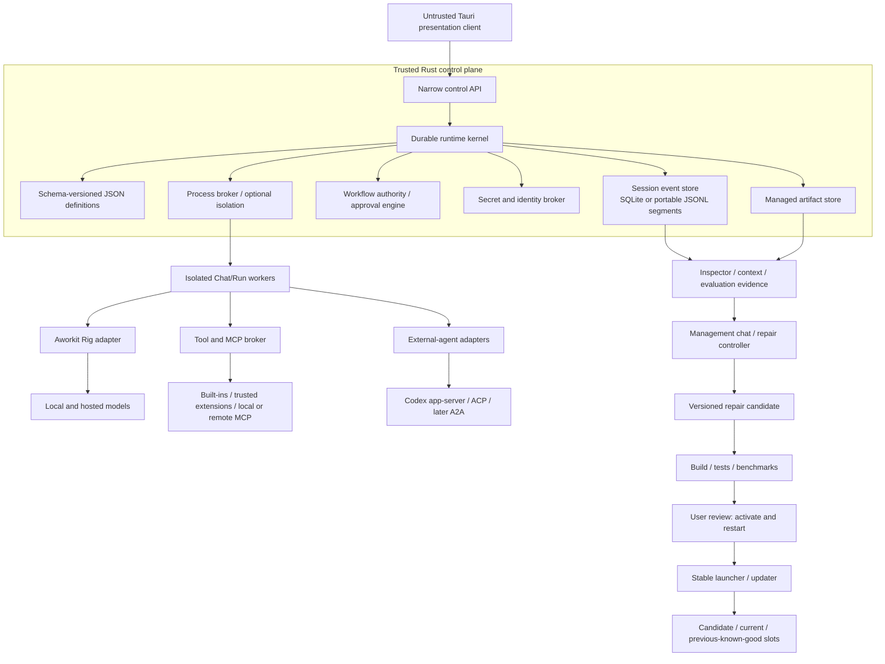

# Aworkit — Product Concept

**Expansion:** Agent Workflow Toolkit  
**Document status:** Researched concept, version 0.1  
**Research date:** 2026-08-19  
**Source:** `aworkit_design_concept.md`

This document preserves the ambition of the original brain dump while turning it into a product and architecture concept that can support production planning. Citations point to primary documentation, repositories, specifications, or research papers listed under **Research sources**.

## Executive concept

> **Aworkit is an Apache-2.0-licensed desktop application for designing, running, inspecting, and improving highly customizable agent workflows across any combination of local models, hosted model APIs, tools, subagents, and external agents. It combines an approachable chat-first experience with visual workflow customization, intelligent routing, and deep runtime transparency, without requiring users to construct their own agent harness.**

Its differentiator is the combination of a highly approachable desktop experience with unusually deep, transparent customization. Users can begin with excellent defaults and chat naturally, then progressively control workflows, routing, tools, agents, evaluation, and runtime behavior. A durable embedded runtime makes that experience reliable; it is an internal architectural foundation, not a separately offered backend product.

### Define Aworkit as a desktop-native, model-location-neutral product

Aworkit is one flexible and exceptionally user-friendly desktop application. Its execution is not local-first: local models, hosted APIs, and external agents are equal first-class capability sources that users may combine freely. A local model is optional, and sophisticated workflows will often delegate demanding work to frontier models or specialized agents. The application should provide excellent default configurations while progressively exposing workflow editing, model routing, evaluation, debugging, and extension capabilities to advanced users.

### Define a focused first release without narrowing the product

Aworkit is a general-purpose agent-workflow desktop application, not a developer-only tool. Nevertheless, its first production release must be designed and evaluated against a bounded set of complete reference workflows. The initial workflow families should cover software development, research and synthesis, and local file or knowledge work. This keeps the architecture domain-neutral while providing concrete standards for usability, reliability, routing quality, and tool integration.

The default experience should serve an individual desktop user, ranging from someone who starts with chat and ready-made templates to an expert who customizes models, agents, tools, routing, and workflow graphs. Shared multi-user workspaces and organizational coordination are separate future capabilities rather than prerequisites for the first release.

## Product definition

### Problem

Current agent products commonly force users to choose among:

- convenient but opaque single-agent applications;
- flexible frameworks that require substantial application engineering;
- visual workflow builders without durable agent-runtime semantics; and
- powerful coding agents that cannot be composed under one portable policy, trace, and evaluation system.

Aworkit should let a user design or request a workflow, inspect its resolved execution plan, run it with controlled access to the machine and remote services, interrupt or approve consequential actions, recover after failures, and compare quality, cost, and latency across routing strategies.

### Primary personas

1. **Guided user** — starts from chat, ready-made workflows, and understandable defaults without needing to learn the graph or routing system.
2. **Workflow author / power user** — customizes models, tools, agents, routing, policies, and reusable workflow graphs.
3. **Extension or integration author** — adds providers, tools, plugins, and external-agent adapters.
4. **Evaluator or maintainer** — maintains representative tasks, graders, baselines, routing experiments, and release evidence.

The same person may fill all four roles in a local installation.

### Core jobs to be done

- “Run this goal across my files or project with the right models and tools, while keeping me in control of risky effects.”
- “Show me exactly what Aworkit supplied, selected, called, changed, and produced.”
- “Turn a successful run into a reusable, versioned workflow.”
- “Compare workflow and routing revisions using reproducible evidence rather than intuition.”
- “Delegate to Codex or another specialist without losing lifecycle control, policy, or provenance.”

### Value pillars

1. **Inspectable:** complete provenance for host-visible inputs, actions, decisions, approvals, results, and artifacts.
2. **Durable:** checkpointed runs survive application or worker failure and have explicit resume semantics.
3. **Explicit authority:** the frozen workflow and its tool settings determine what Aworkit-mediated actions a model may perform; the model cannot broaden them during a run.
4. **Composable:** typed workflows can use models, tools, subagents, and external agents through stable Aworkit contracts.
5. **Evidence-driven:** evaluation and routing telemetry are first-class product data.
6. **Model-location-neutral:** local models, hosted APIs, and external agents are equal first-class capability sources. Local-only, hosted-only, and hybrid configurations are all supported.

### Non-goals for the first production release

- A general consumer assistant for every domain.
- A shared multi-user workspace/server in the first production release.
- A public marketplace for unrestricted native plugins.
- Silent mutation of saved workflows during a run.
- Guaranteed access to a model’s private chain of thought.
- Autonomous promotion of self-authored application binaries.
- A single universal score that permanently ranks all models.

## Reference assessment

### Reuse the proven desktop shell selectively

The default strategy is selective reuse rather than either a full ChatShell fork or a complete clean-room rewrite. The original link points to the `chatshell-agent` library; `chatshell-desktop` is the relevant donor for the application shell and standard desktop-agent UI. Aworkit should follow that familiar structure and reuse or adapt license-compatible components when they already implement the same behavior well. [R01](#r01) [R02](#r02)

The agreed desktop shell is:

- A left navigation area containing **New Chat** and top-level tools such as schedules and the Aworkit Workflow Studio.
- Projects with their chat histories below those primary actions.
- Configuration and settings access at the bottom of the navigation area.
- A large Chat/Run area on the right.
- A composer that can select the workflow and expose other relevant run choices without overwhelming the basic experience.
- Settings that build on proven provider/model configuration, credential, and MCP-management patterns already present in ChatShell.

There is no benefit in rebuilding generic pieces merely to make them different. After a per-component and per-file audit, Aworkit may reuse suitable application-shell layout, panel behavior, chat rendering, streaming presentation, theme/settings infrastructure, and provider/model/MCP forms. Aworkit-specific workflow definitions, visual editing, routing, policy, runtime inspection, evaluation, and persistent contracts remain Aworkit-owned so inherited implementation choices do not constrain the product.

Aworkit itself is distributed under Apache-2.0. Reused or substantially modified code must retain the required license and applicable notices and be recorded in a third-party provenance inventory. The basic structural look may be familiar, but the Aworkit name, icons, content, workflow interactions, and product identity remain its own. ComfyUI’s graph interaction concepts should be independently implemented rather than copied because its backend and official frontend are GPL-3.0. [R03](#r03) [R37](#r37) [R44](#r44)

| Reference | Adopt or study | Do not assume |
|---|---|---|
| ChatShell Desktop / Agent | Selectively reuse or adapt the desktop shell, sidebar/chat/composer patterns, settings, provider/model/MCP UI, streaming presentation, and suitable Tauri-Rust integration after audit | That its agent, persistence, or patched Rig types are stable Aworkit contracts, or that license permission also grants branding rights |
| Hermes Agent | Goal-directed loop, skills, memory patterns, subagents, scheduled work, local/cloud backends | That in-process permission checks are a security boundary; Hermes explicitly identifies OS isolation as the relevant boundary for adversarial models [R04](#r04) |
| DeepSeek Harness / Cordis | Scoped services, capability seams, reversible registration, ordered composition, append-only model-visible events | Production maturity; DeepSeek Harness is marked developer preview and Cordis is a young research direction [R05](#r05) [R06](#r06) |
| Rig | Rust-native providers, completion/embedding abstractions, tools, MCP helpers, streaming, tracing hooks | Durable scheduling, persistence, policy enforcement, or security isolation; isolate upstream churn behind Aworkit-owned adapters [R07](#r07) |
| ComfyUI | Direct manipulation of nodes, typed links, reusable graph files, separation of node definitions and instances | That an acyclic inference graph is enough for interrupts, loops, recovery, compensation, or side-effectful agents [R08](#r08) |
| Codex | Project/chat organization and optional worktree project-management patterns [R41](#r41) [R42](#r42) | That UI imitation is an integration. Use App Server for the supported rich-client lifecycle, diffs, approvals, and streamed events, and negotiate/version-pin its capabilities [R09](#r09) [R10](#r10) |

## Product principles

1. **One authority for each kind of data.** Aworkit-owned configuration and workflows live as schema-versioned JSON files; each Chat/Run has exactly one canonical history backend; database indexes and projections over project files are disposable.
2. **The model proposes; the runtime disposes.** Models can suggest plans and actions, but deterministic components validate and authorize them.
3. **Freeze what ran.** Every Chat/Run records the frozen workflow JSON and its resolved references, project source and dirty-state identity, relevant OS/runtime/toolchain and environment metadata, and hashes of policies, prompts, tool schemas and executables, plugins, router, and model capability snapshots.
4. **Workflow-defined authority.** Aworkit-mediated agents and tool calls receive the tools and configurations declared by the frozen workflow. Trusted extension code follows the explicit full-user-permission model in A13.
5. **Fail loudly at boundaries.** Unsupported cancellation, resume, tool passing, or schema behavior is reported; adapters do not silently degrade.
6. **Promote changes explicitly.** A successful Chat/Run-local adaptation can become a new revision, never a hidden edit to its frozen workflow.
7. **Measure cost per successful outcome.** Token price alone is not the product objective.
8. **Progressive disclosure.** A basic mode presents goals, plans, approvals, and results; an advanced mode exposes graphs, traces, policy, and routing evidence.
9. **Keep context explicit and scoped.** Harness nodes transform versioned context; delegated agents receive temporary child contexts and return defined results rather than silently sharing or merging all working state.

## System architecture

### Combine a scoped plugin graph with a small trusted application core

Aworkit follows the plugin and scoped-service philosophy for functional behavior. Models, providers, agent profiles, agent loops, routers, tools, workflow nodes, context providers, evaluators, external-agent adapters, and suitable UI extensions can be registered, composed, scoped, and replaced through versioned contracts. Each workflow resolves the service graph it requires.

A small embedded Rust application core is deliberately not replaceable by ordinary runtime plugins. It owns durable session-event sequencing and Chat/Run state across the selected storage backend, capability and permission enforcement for Aworkit-brokered operations, exact approval binding, secret brokerage, supervised process launching, plugin identity/integrity/compatibility records, and installed-version state. A separate privileged release signer/updater owns promotion-bound release signatures, atomic activation, and rollback slots. These mechanisms do not decide what work an agent performs; they keep the application lifecycle and Aworkit-mediated behavior coherent and inspectable.

“Everything is visible and configurable” therefore applies to functional agent behavior, not to replacing the application’s canonical state, approval UI, updater, or core lifecycle. Third-party extensions are explicitly trusted installed software; Aworkit does not claim to contain arbitrary code that the user chose to run with their account. [R05](#r05) [R27](#r27)

### Use an internal multi-process architecture with risk-adaptive isolation

Aworkit remains a single desktop product, but its presentation, trusted control functions, and agent execution occupy separate internal trust zones. The Tauri WebView is treated as an untrusted presentation client with a narrow command API. Tauri capabilities restrict WebView-to-Rust command access, but they are not an agent-execution sandbox. [R11](#r11) [R12](#r12) A small Rust application core owns durable state, policy, approvals, secrets, and worker lifecycle.

Chat/Run workflow instances execute in separately managed workers. Shell commands, trusted extension hosts, local MCP servers, and external agents execute as supervised child processes where their integration permits it. Process separation provides crash containment, cancellation, logging, dependency separation, and restartability; it does not by itself restrict trusted extension code, which normally retains the desktop user’s authority. Local process trees can be terminated independently, and a worker failure must not terminate the desktop UI or corrupt committed Chat/Run state.

Isolation is risk-adaptive rather than container-only. Consequential model-generated execution and workflows handling hostile input may use stricter OS-specific profiles. Trusted plugins are not individually sandboxed by default. Users may later opt to wrap a plugin host, project worker, or the whole agent environment in a container, VM, remote worker, or other high-isolation profile, but that is an execution choice rather than the extension contract.

These boundaries are implementation details. The normal user experience remains a coherent desktop application with clear permissions, approvals, cancellation, recovery, and optional inspection. [R04](#r04)



### Component responsibilities

| Component | Owns | Must not own |
|---|---|---|
| Trusted kernel | Durable state transitions, session-event sequencing, storage-backend ownership, frozen-workflow authority for brokered operations, approvals, secret handles, supervised launches, optional isolation, and installed-version state | Model planning, release signing, activation, or user-interface rendering |
| Workflow compiler | JSON Schema validation, harness-graph validation, context-contract checking, transitive tool-authority preflight, and canonical JSON serialization | Hidden graph mutation or changing authority after the Chat/Run is frozen |
| Chat/Run worker | Context revision, branch/loop execution, temporary child-context lifecycle, prompt compilation, agent loops, node execution, and adapter calls | Long-term credentials, promotion authority, audit deletion |
| Provider gateway | Aworkit model request/event types, capability discovery, retries permitted by policy, usage normalization | Persistent domain objects tied to Rig/provider internals |
| Tool broker | Frozen tool-configuration enforcement, schema validation, side-effect classification, timeouts, and result envelopes | Broadening its configured authority or pretending host execution is scoped |
| External-agent adapter | Lifecycle and capability negotiation, events, artifacts, cancellation, adapter-specific protocol | Pretending absent capabilities exist |
| Desktop UI | Authoring, monitoring, diffs, approvals, history inspection, and evaluation views | Direct filesystem/process/network authority |
| Improvement lab | Candidate generation and experiments in isolation | Evaluator mutation, signing keys, release promotion, running-install changes |
| Release signer/updater | Promotion-bound release signature, activation manifest, atomic install, rollback slots | Candidate generation, evaluation criteria, or agent-controlled policy |

## Canonical product and execution model

### Separate JSON definitions from scoped, portable session history

Long-lived state uses Aworkit-owned, versioned schemas. Neither Rig run snapshots nor an external agent’s transcript becomes a persistence contract: upstream formats can change, depend on one machine, and contain sensitive provider payloads. Rig’s steppable `AgentRun` remains a version-pinned worker implementation or transient recovery aid behind Aworkit contracts. [R13](#r13)

Every Aworkit-owned configuration document—including application, project, provider, agent-profile, routing, plugin, policy, and workflow definitions—is a physical, schema-versioned JSON file. Its body is never mirrored into SQLite. The database may retain only a rebuildable file catalog—identity, path, content hash, validation state, relationships, and search/index data—and JSON remains authoritative whenever a cache disagrees. Secrets live in the operating-system credential store; JSON contains symbolic secret handles, never credential values.

| Data | Canonical owner |
|---|---|
| Application, provider, agent, router, plugin, and policy definitions | Physical schema-versioned JSON files |
| Workflow definitions | Physical schema-versioned JSON files; each started Chat/Run records the frozen canonical bytes and hash in its selected history backend |
| Credentials and secret values | Operating-system credential store |
| Local-only Chat/Run history | Typed semantic session events in SQLite |
| Git-portable project Chat/Run history | Immutable parent-linked JSONL segments under `.aworkit/sessions/` |
| Project/Chat catalog, search, usage aggregates, and parsed-file indexes | SQLite; entries derived from project files are disposable and rebuildable |
| Large outputs and attachments | Managed files referenced by hash and metadata |
| Process and crash diagnostics | A bounded set of rotating non-canonical logs |

Each Chat is also exactly one logical workflow Run. Its scoped session-event history is not an event-sourced model of the entire desktop application. Semantic events cover user inputs, assistant output, workflow and step boundaries, model calls, tool calls/results, approvals, routing/fallbacks, delegation, waiting, interruption/cancellation, context transformations, and usage. The UI, context compiler, inspector, and recovery logic fold the same ordered history. Folding reconstructs views and resumable logical state; it never reruns a provider, tool, external agent, or other side effect. Raw token chunks are not retained by default; an explicitly enabled, local forensic mode may capture more detail under separate retention policy.

Each Chat/Run has exactly one canonical backend. A local Chat/Run is owned by SQLite. An explicitly portable project Chat/Run is owned by project files, while SQLite holds only a locator and rebuildable indexes. **Make portable** is an ownership transfer: Aworkit writes and validates the project representation, switches the canonical locator, and removes the former SQLite event bodies through a crash-safe migration. It does not create two synchronized writable copies.

Portable sessions use a Git-friendly immutable layout:

```text
.aworkit/
  project.json
  sessions/
    <session-id>/
      session.json
      segments/
        <content-hash>.jsonl
  objects/
    <content-hash>
```

`project.json` provides a stable project identity independent of checkout path. `session.json` is the immutable identity and policy header for the Chat/Run lineage. Each bounded, content-addressed segment contains one completed user-input cycle or safe workflow checkpoint and names its parent segment. There is no committed mutable head file: current tips are derived from parent links. To make identifiers stable across operating systems and implementations, each event uses a specified canonical JSON profile, segments use UTF-8 with a fixed LF framing rule, and the segment ID hashes those canonical bytes. RFC 8785 is the baseline for canonical JSON rather than an Aworkit-specific serializer. [R51](#r51) Project paths are relative, while every segment records the relevant Git commit and optional dirty-state digest, workflow/configuration revision hashes, required capabilities, redaction profile, and artifact references. Large or sensitive payloads stay local unless an explicit portable-artifact policy admits them. DeepSeek’s configurable JSONL backend demonstrates the value of a backend-neutral logical event stream, but its one-growing-file/one-live-writer contract is not safe for Git synchronization; Aworkit therefore uses immutable bounded segments instead. [R48](#r48)

If two computers continue the same segment independently, Git receives two new files rather than competing appends to one file. Aworkit recognizes the two children as explicit Chat/Run branches and never interleaves or timestamp-sorts them. Each branch is presented as a distinct continuation in the chat history while retaining its common lineage. Git’s union merge is unsuitable because combined lines may have arbitrary order. [R49](#r49) A user may continue either branch or deliberately create a synthesis Chat/Run.

After a clone or pull, Aworkit validates paths, hashes, sizes, schema versions, parent relationships, and event vocabulary before rebuilding its local index. Imported commands, tool calls, approvals, and plugin references are inert history: they grant no authority, install nothing, and are never re-executed. Continuation rebinds the project root, workflows, models, tools, plugins, permissions, and secret handles against the current trusted installation. Aworkit-owned loops can resume their logical state; an external agent resumes natively only when its adapter supports portable import, otherwise Aworkit starts a new external-agent session with the approved portable context.

Project portability is opt-in at project or individual-Chat/Run level. Aworkit never commits or pushes without an independent explicit user action. Before the first portable write, it previews the capture/redaction policy and warns that collaborators—or the public—may read committed history and that deleting a file later does not remove it from existing Git history, clones, or forks. Credentials, authorization headers, environment secrets, hidden reasoning, and inherited approval authority are never portable. [R50](#r50)

Agents and tools normally inspect history through stable, permission-filtered read APIs that render Markdown, JSON, or JSONL on demand. A generated textual view is not another persisted history. Advanced users may inspect the documented files or versioned read-only database views, but workers never receive unrestricted access to the application database.

| Object | Meaning |
|---|---|
| Workspace | Local Aworkit environment plus references to JSON configuration, trust state, identities, and settings |
| Project | One or more authorized folders, stable project identity, JSON instructions/policy overlays, and a Chat/Run storage policy |
| Chat / Run | One user-facing conversation and exactly one logical instance of a frozen workflow; it may span many user inputs, waiting periods, restarts, and workflow steps |
| Goal | Desired outcome, constraints, acceptance criteria, and budgets carried by the Chat/Run or one of its tasks |
| User-input cycle | One user input and the workflow activity it triggers inside the same Chat/Run; it is not another Run |
| Step / Attempt | Logical workflow operation and an individual execution attempt |
| Harness Context Revision | One logical, versioned snapshot of the Chat/Run's active conversation, goals, prompt layers, evidence, working state, decisions, lineage, and budgets; implementations may use structural sharing rather than copying it |
| Scoped Subagent Context | A temporary child context derived from selected parent context for one delegated lifetime; it returns through an explicit result contract and is never merged wholesale into its parent |
| Artifact | Immutable or versioned file, diff, report, dataset, trace attachment, or result |
| Workflow Definition | The editable JSON source; the Chat/Run stores a content-addressed frozen snapshot rather than requiring a separately published workflow object |
| Resolved Chat/Run Snapshot | Immutable references and hashes for the frozen workflow JSON, project/source state, environment/toolchain identity, and configuration/capability revisions used by the Chat/Run |
| Agent Profile | JSON-defined role, instructions, allowed capabilities, context policy, and routing policy |
| Provider / Model Snapshot | Resolved identifier, capabilities, parameters, prices, limits, and health evidence |
| Tool / Plugin Manifest | Versioned JSON schema, execution form, configuration, effects, platform support, and provenance |
| Policy Decision / Approval | Deterministic decision and any user authorization bound to an exact action |
| Evaluation Case / Result | Versioned input, graders, expected properties, evidence, and outcome |

All objects receive stable IDs. A Chat ID is also its logical Run and session identity; external adapters may additionally record their own native session or thread IDs. Session events carry that Chat/Run ID, branch identity, causal parent, correlation ID, monotonic sequence within their branch, wall-clock time, schema version, producer identity, and integrity metadata. Large content is stored as managed content-addressed artifacts and referenced from semantic events. Sensitive local payloads use platform-supported protection; portable histories exclude or redact data their declared policy does not permit. The resolved Chat/Run record also identifies the project revision and dirty-diff hash, workflow/configuration revision hashes, tool executable and plugin digests, OS/architecture, relevant runtime/toolchain versions, and non-secret environment facts required to interpret the execution.

## Workflow language and runtime

### Use one visual JSON harness graph with resolvable node and model references

An Aworkit workflow is a long-lived agent harness represented by one schema-versioned JSON file and edited directly by the visual canvas. The same document contains nodes, harness transitions, node configuration, positions, groups, comments, and other shared canvas layout. There is no second editable graph and no database copy of the workflow body. ComfyUI’s current workflow format provides a useful precedent for one JSON Schema-defined visual graph document and approachable missing-node handling, but not for Aworkit’s execution semantics: Aworkit composes context-carrying agent harnesses rather than acyclic inference dataflow. [R08](#r08) [R14](#r14)

When the first input starts a Chat/Run, the runtime freezes the selected workflow JSON for the lifetime of that Chat/Run so later canvas edits cannot change its harness. This is an internal safety and provenance mechanism, not another workflow object that users must publish or manage.

### References and missing dependencies

Model-facing nodes reference a stable model target already configured in Aworkit. A target may identify a specific configured model, a user-defined model tier, or a routing profile. Provider setup, endpoints, credentials, and API keys remain in application configuration and the operating-system credential store; they are never embedded in the workflow.

Node instances reference a stable, namespaced node-type ID and compatible schema version. Built-in and installed plugin registries resolve those IDs to their definitions and executors. Modern ComfyUI node schemas similarly use globally unique node IDs and declared inputs and outputs. [R52](#r52) Aworkit adopts that portability principle while defining its own harness-oriented context and transition contracts.

Opening a workflow always preserves and displays the complete graph, including unknown nodes and their original configuration and connections:

- A missing model target is visibly **Unresolved** and offers to select an existing target or create the missing configuration.
- A missing node implementation is visibly **Missing plugin** and shows the required plugin and node identifiers plus any declared compatible version.
- An installed but incompatible node or plugin version is reported separately from a completely missing dependency and may offer an explicit migration when one exists.
- A Chat/Run cannot start while a required workflow reference or connection remains unresolved, but the workflow remains inspectable, editable, and exportable without data loss.

The first release only needs to direct users to plugin settings or a documented manual installation path. It does not require a plugin repository, package manager, or automatic installation. The identifiers and diagnostics establish a clean seam for a future manager. Even then, an imported workflow must never install or activate code without a separate explicit trust decision. ComfyUI Manager’s missing-node prompt is a useful interaction precedent. [R53](#r53)

### Built-in graph vocabulary

Aworkit keeps visual authoring direct, but the graph is a harness program rather than a generic dataflow pipeline. Its primary transitions carry execution together with a versioned Harness Context. Optional typed fields or artifact references make particular contracts explicit, but their availability does not independently fire nodes.

The built-in vocabulary should grow from a compact core while covering these capabilities. The paired labels below describe behavior, not a requirement that every term become a separate node or ship in the first milestone:

- **Intelligence:** Agent, Model Call, Subagent, and External Agent.
- **Prompt and context composition:** Instruction or Prompt Layer, Context Select, Transform, Result Integration, Memory or Evidence Select, and Artifact Reference.
- **Actions:** Tool or MCP Call and Subworkflow.
- **Harness control:** Chat Input, Chat Output, Router or Condition, Fork, bounded Loop Region, For-Each, Join, Wait for Input, Human Approval, Complete, and Retry or Fallback.
- **Quality control:** Evaluator, Gate, and Score or Aggregate.

Loops, fan-out, retries, and recursive subworkflows have explicit hard bounds for iterations, concurrency, depth, time, tokens, and cost. Control nodes define failure, cancellation, and join behavior. Nodes that can write, communicate externally, deploy, delete, spend money, or use credentials declare those effects; a non-idempotent action is never repeated implicitly after an uncertain outcome.

### Small, durable extension contract

A node provider registers only the stable node-type ID and version, display metadata, configuration schema, context contract, harness transitions, optional typed side fields, effect/capability declaration, and executor binding. The workflow stores node instances, not executable plugin code. Unknown fields and unresolved node payloads round-trip losslessly so newer workflows survive older Aworkit installations.

An illustrative fragment:

```json
{
  "schema_version": "aworkit.workflow/1",
  "workflow_id": "software-change",
  "name": "Implement and review",
  "nodes": [
    {
      "id": "implement",
      "type": "aworkit.agent",
      "type_version": 1,
      "position": [120, 180],
      "config": {
        "agent_profile": "coding-agent",
        "model_target": "tier:quality-coding"
      }
    },
    {
      "id": "review",
      "type": "aworkit.evaluator",
      "type_version": 1,
      "position": [520, 180],
      "config": {
        "model_target": "tier:review"
      }
    }
  ],
  "links": [
    {
      "kind": "context",
      "from": "implement",
      "to": "review"
    },
    {
      "kind": "route",
      "from": "review",
      "outcome": "revise",
      "to": "implement",
      "loop": "revision-loop"
    }
  ],
  "groups": []
}
```

This fragment illustrates the direct document model rather than fixing the final schema. The actual schema and built-in node set should be derived from representative simple workflows and advanced harness loops, then protected by migration and conformance tests as the graph language evolves.

### Freeze the graph per Chat/Run while allowing dynamic agent behavior

A newly created Chat remains a draft while the user selects its workflow and prepares the first input. The first submitted input resolves the workflow, models, tools, plugins, configuration, authority, project state, and other references into one immutable Chat/Run snapshot. Resolution must succeed before execution begins. The selected workflow and resolved harness then remain fixed for the entire Chat/Run.

Every later user message is another input event to that same workflow instance, not another Run. A built-in **Simple Chat** workflow can loop from Chat Input through an Agent and Chat Output back to Wait for Input. When the workflow is already processing, ordinary inputs queue in order; immediate interruption or steering occurs only through an explicit runtime control that the workflow and active adapter support.

This does not make execution static. Conditions, bounded loops, routing, retries, parallel branches, joins, waits, approvals, and evaluators remain dynamic through the graph’s normal nodes and links. An Agent node may plan tasks, choose tools, delegate work, react to results, and revise its own approach within its configured capabilities and budgets without rewriting the workflow graph.

Editing the canvas after a Chat/Run has started affects only newly created chats. When an agent identifies a lasting improvement, it may propose an ordinary change to the workflow JSON. Aworkit shows the graph and JSON diff, validates the result, and applies it only after the user accepts it; the active Chat/Run remains on its frozen snapshot. A later version may add an explicit **Dynamic Subworkflow** node that creates a bounded temporary child graph. Such a child graph is validated before execution, recorded in the session history, and cannot modify the parent workflow file or the already-running parent graph.

### Runtime state machine

A Chat/Run progresses through explicit durable states. It begins as `draft`, then moves through `resolving` and `runnable` to `running`. While active it may enter and leave `waiting_for_input`, `awaiting_approval`, `paused`, `interrupted`, `recovering`, or `cancelling`. Its terminal state is `completed`, `failed`, or `cancelled`.

A terminal Chat/Run remains fully inspectable but accepts no more input. **Continue in new chat** or **Fork** creates another Chat/Run from explicitly selected prior context and requires a workflow selection; it never reopens or rewrites the terminal history.

Each step has attempts with its own lifecycle. The kernel records the intent event before dispatch and records a terminal result or an explicit unknown-outcome state after disruption. Recovery folds the selected backend’s committed session history, reconciles leases and child processes, and resumes only operations whose contracts permit it; it never re-executes a recorded side effect merely because the event was loaded. Cancellation is requested and tracked end-to-end; local child-agent/process trees are forcibly cleaned up, while unsupported or unconfirmed remote cancellation remains visibly `cancelling` or `unknown_outcome` until reconciliation.

The runtime must support:

- durable checkpoints and leases;
- interrupt/resume and human-input nodes;
- bounded parallel branches and deterministic joins;
- explicit partial failure and compensation;
- per-Chat/Run emergency stop and global execution pause;
- backpressure for event streams and tool output;
- artifact size and retention policies; and
- crash/fault injection tests for every state transition.

## Agent and model layer

### Use Rig behind a narrow Aworkit-owned engine boundary

Rig is a strong Rust foundation for provider-neutral completion, streaming, tools, MCP integration, and agent execution. Aworkit should use those facilities without making Rig its product architecture or persistence model. [R07](#r07)

Aworkit owns workflow execution, model-target resolution and routing, agent profiles, frozen tool configuration, approvals, retries and fallback policy, normalized events, usage accounting, session history, and recovery. Its workflow JSON, configuration JSON, database records, plugin contracts, and public APIs contain only Aworkit-owned types.

Behind that boundary, `rig-core` is the preferred default engine for supported model-provider requests, responses, streaming, tool-call conversion, and MCP helpers. `rig-agent` may power suitable Agent nodes, but it is one replaceable agent-loop implementation rather than the workflow runtime or the only permitted harness. Rig’s model-selection hooks may implement an Aworkit routing decision inside the adapter, but they never own that policy. External agents such as Codex retain their own lifecycle adapters and are not forced through Rig. [R15](#r15)

The adapter translates between Aworkit’s stable request, stream-event, result, usage, capability, tool, and error contracts and the selected Rig version. Rig-native state and `AgentRun` snapshots are sensitive, version-specific worker details and never become canonical Aworkit persistence. Upstream still lacks a complete normal-runner path for resuming a restored `AgentRun`, reinforcing this separation. [R13](#r13) [R55](#r55)

Rig is version-pinned and tested behind provider and agent-loop conformance suites. Upgrades happen inside the adapter, and Aworkit may replace or bypass Rig for an individual provider or loop without migrating workflow files or session history. Rig’s recent releases include material breaking changes across its core, agent, client, hook, and execution APIs, so this boundary is an operational requirement rather than speculative abstraction. [R54](#r54)

### Agent profile

An agent profile is not merely a prompt plus model tier. It declares:

- purpose and instructions with provenance;
- input and result schemas;
- allowed tool and delegation capabilities;
- context selection and compression policy;
- routing policy and eligible provider/model set;
- iteration, delegation, cost, token, and wall-time budgets;
- verification and stopping rules;
- workspace and data-classification constraints; and
- fallback, cancellation, and failure behavior.

The agent loop is steppable and event-driven. Provider retries are distinct from switching providers. Concurrent read-only tools may run in parallel, but their results are correlated and reintegrated deterministically. Compression must preserve tool-call/result pairing and record exactly which host-visible context was replaced by which summary artifact.

### Context compiler and memory

The runtime—not an opaque prompt template—compiles each model request from versioned instruction layers, the goal and current step, selected Chat/Run history, authorized project artifacts, explicit memory entries, tool schemas, budgets, and prior results. It writes a request manifest that records every included item, its source and scope, any transformation or summary, the inclusion reason, token contribution, and redaction. The inspector renders the same manifest.

Persistent memory is an explicit JSON definition or managed artifact, not hidden context. Each entry carries its author, provenance, scope (`chat`, `project`, or local user), creation and validation times, confidence/status, access policy, expiry/invalidation rules, and links to supporting evidence. Memory creation and mutation are recorded as policy decisions in the applicable session history; every retrieval used in a request is visible. Deletion and redaction follow the selected local or portable retention policy, and stale or contradicted memory never silently enters future context.

### Provide four portable default model tiers backed by user configuration

Aworkit reserves four stable model-tier IDs that exist in every installation:

| Tier | Selection intent |
|---|---|
| `tier:fast` | Prioritize low response latency among eligible configured models |
| `tier:simple` | Use the least capable configured model that is sufficient for straightforward work |
| `tier:balanced` | Use the user’s normal quality, latency, and cost trade-off; this is the default |
| `tier:quality` | Prioritize the highest expected result quality among eligible configured models |

These names express selection intent rather than a universal intelligence score. In particular, `fast` and `simple` are distinct: a low-latency model may be relatively expensive, while the most economical model sufficient for a simple task may not be the fastest.

All four IDs always exist, so a portable workflow never reports them as missing. The user maps each tier to an exact configured model, an ordered fallback list, or a routing policy. An unmapped tier is **Unconfigured** and opens the model setup UI. When only one model is available, initial setup may map all four tiers to it. Users may also create custom tiers such as `tier:local`, `tier:quality-coding`, or `tier:review`; only those custom identifiers can be genuinely absent on another installation.

Cost efficiency applies within every tier rather than requiring a separate `economy` tier. Locality, privacy, region, modality, context size, tool use, and structured-output support are separate eligibility constraints, not tier names. A model node declares its requirements, the selected tier resolves only among compatible configured candidates, and an incompatible binding is reported before execution. Every Chat/Run records the concrete provider and model revision to which the tier resolved.

The internal model catalog should record at least:

- provider and immutable model/revision identifiers where available;
- modalities, context/output limits, structured-output and tool capabilities;
- reasoning controls and observable reasoning format;
- locality, privacy, region, and data-retention constraints;
- measured latency, availability, rate limits, and price snapshot;
- workload-specific evaluation results and uncertainty; and
- last validation time and known compatibility exceptions.

## Routing architecture

### Start with deterministic model routing and controlled escalation

Aworkit’s first production router must be understandable from the workflow and the user’s model configuration. A model-based node requests a named tier and declares its requirements; the resolver selects a concrete configured model and returns an inspectable resolution plan. The tier expresses the user’s intent, not a universal model ranking. Research demonstrates useful strong/weak routing and model cascades, but it does not yet establish that a learned router will reliably improve heterogeneous, multi-step desktop-agent workloads. Recent benchmarks also show that sophisticated routers do not consistently beat a strong simple baseline. Aworkit should therefore ship a deterministic router first while preserving a clean extension point for later adaptive routing. [R16](#r16) [R17](#r17) [R46](#r46)

The release-one resolution order is:

1. **Apply hard eligibility constraints.** Exclude candidates that violate locality, privacy, region, retention, modality, context, structured-output, tool-use, credential, organization, availability, or budget requirements.
2. **Resolve the configured tier policy.** Honor an exact binding or the user-defined ordering of eligible candidates. `tier:simple` means the user’s configured target for straightforward work; release one does not pretend that a prompt classifier can reliably infer the least capable sufficient model.
3. **Prepare same-tier fallback.** A fallback substitutes another eligible candidate without changing the requested intent, normally after a classified availability, quota, rate-limit, or provider failure.
4. **Apply only explicit escalation guards.** Moving from one tier to a stronger tier is allowed only when the workflow or agent policy permits it and objective evidence triggers it—for example, repeated schema failure, a failed test or evaluator, context overflow, repeated lack of progress, or an explicit workflow guard. Model self-confidence alone is not evidence.
5. **Verify and record.** Apply the step’s verification rule and persist the decision, result, cost, and latency in the Chat/Run history.

Retry, fallback, and escalation are different operations: retry repeats the same concrete request policy, fallback changes the concrete model while preserving the tier, and escalation changes the requested tier. None may silently repeat a request with an ambiguous outcome or external side effect; the node’s effect contract, idempotency policy, and approval rules still govern execution.

The engine boundary is intentionally small:

```text
resolve_model(
  requested_tier,
  step_requirements,
  candidate_catalog_snapshot,
  policy_snapshot,
  runtime_evidence
) -> resolution_plan
```

The resolution plan contains the selected concrete target, ordered same-tier fallbacks, permitted escalation guards, required verification, and trace metadata. A Chat/Run records the catalog and policy snapshots, rejected candidates and reasons, selected provider/model revision, fallback or escalation cause, verifier result, cost, and latency. Given the same snapshots and runtime evidence, resolution is reproducible.

Model routing is deliberately narrower than workflow routing. Condition, Switch, and Router nodes choose graph paths; an Agent node owns its execution strategy; and an External Agent node explicitly delegates to an autonomous executor such as Codex. Delegating to another executor changes tool authority, lifecycle, persistence, and continuation semantics, so it can never occur as an implicit model fallback.

Later, a replaceable scorer may rerank only the candidates that passed the immutable eligibility and policy checks. It may use partial-trajectory evidence because the initial prompt alone can be insufficient for multi-turn software work, but it may never restore an excluded candidate or relax a safety rule. It is promoted only after it beats the deterministic router and fixed-model baselines on versioned, representative held-out suites covering verified quality, total cost, p50/p95 latency, severe failures, privacy/safety slices, and drift; shadow evaluation precedes activation. Until then, the deterministic policy remains the production baseline. [R18](#r18) [R19](#r19) [R20](#r20) [R47](#r47)

## External agents and protocol boundaries

### Integrate external agents through a small Aworkit adapter contract

A model reasons inside an Aworkit-controlled step, an MCP server supplies bounded tools or resources, and an external agent is a separately running executor with its own session, tools, permissions, progress, and failure behavior. Codex and similar autonomous harnesses therefore cannot be treated as ordinary model targets or as tools that merely accept a prompt. Delegation is always an explicit **External Agent** node and can never occur as an implicit model fallback.

The node references a configured external-agent target and supplies only the task, authorized project roots, granted capabilities, budgets and timeout, requested result schema, and continuation policy needed for that delegation. The normal UI keeps this compact; protocol-specific controls appear only when the selected adapter supports them.

Each adapter exposes a small common contract:

- report protocol/schema version and capabilities;
- start a task and, when supported, continue, resume, or fork its native session;
- stream normalized progress, message, tool, approval, and artifact events;
- broker permission or human-input requests through Aworkit;
- request cancellation and report whether it was accepted or confirmed;
- return a typed result, artifacts, usage/cost when available, and a classified failure; and
- terminate or reconcile owned processes after timeout, crash, cancellation, or application restart.

Capability preflight is mandatory. A required but unsupported feature causes a clear incompatibility before execution; an optional degradation remains visible. Aworkit records the adapter and protocol versions, negotiated capabilities, native session identifier, normalized events, decisions, and result in the canonical Aworkit session history. Native agent state may still exist behind the adapter for continuation, but it is implementation-owned rather than a second canonical Aworkit history.

Aworkit owns correlation, budgets, capability grants, approval binding, secret brokerage, retention, and worker lifecycle. An adapter may pass only explicitly selected instructions, tools, MCP servers, project roots, and scoped credential handles that the target actually supports. It never forwards the user’s complete MCP configuration or raw credentials by default. Unsupported cancellation, continuation, or event capture is reported honestly rather than emulated.

### Protocol roles and rollout

- **Codex App Server first:** use the supported local `stdio` transport for the initial rich adapter. It provides authentication, thread start/resume/fork, turn and item events, approvals, interruption, and version-specific generated schemas. Aworkit pins and validates the installed schema, uses the stable API surface by default, and does not depend on the experimental WebSocket transport or experimental fields for production behavior. [R09](#r09) [R10](#r10)
- **ACP next:** provide a generic local coding-agent adapter where an agent supports ACP’s initialization, session, progress, permission, filesystem, terminal, and cancellation contracts. Adapter conformance tests determine the usable subset; protocol branding never substitutes for observed capability support. [R25](#r25)
- **MCP remains a capability protocol:** use it for tools, resources, prompts, and related host/server exchange, not as Aworkit’s universal child-agent lifecycle. The current stateless protocol keeps orchestration, consent, and cross-server context with the host. Treat tool annotations and remote output as untrusted. [R23](#r23) [R24](#r24) [R43](#r43)
- **A2A later:** add an adapter for remote, potentially opaque agent services if the reference workflows require its discovery and asynchronous task model; it is not on the critical path for the initial desktop release. [R26](#r26)

## Tools and plugins

### Use an explicit trusted-extension model

Aworkit is a single-user desktop agent whose useful extensions often need broad access to files, processes, networks, GPUs, native libraries, language runtimes, and external applications. Mandatory per-plugin sandboxing would work against that purpose and exclude much of the existing tool ecosystem. Installing and enabling an extension is therefore an explicit decision to run trusted code with the desktop user’s permissions. This follows the practical model used by Hermes plugins, local MCP servers, and ComfyUI custom nodes: their normal extension paths execute trusted installed code, while stronger whole-environment isolation is a separate operator choice. [R04](#r04) [R24](#r24) [R56](#r56) [R57](#r57)

The normal third-party integration form is a supervised subprocess, dedicated language host, or local MCP server. It retains ordinary user access. The process boundary exists for dependency separation, language neutrality, health monitoring, logging, cancellation, crash recovery, and restart—not as a security claim. Bundled or deliberately selected components may run in-process where tight integration justifies it; a stable native in-process plugin ABI is not required for the first release. WASM may later be supported as an optional portability format, but it is neither mandatory nor privileged as the default.

DeepSeek-style scopes remain useful for registration visibility, composition, and lifetime, but they are not permissions or containment. Policy and approval guarantees apply to operations that an extension invokes through Aworkit’s brokered interfaces. Fully trusted code can instead use the operating system directly, so neither a manifest nor an in-process allowlist can honestly guarantee that it cannot bypass those interfaces. The product must state that limitation rather than presenting permission theater. [R05](#r05) [R27](#r27)

### Installation and trust contract

- Discovery never executes code. Installation and enabling are separate, explicit actions.
- Before enabling an extension, Aworkit shows its source, publisher or provenance, exact version or commit, digest, entry point or executable, install commands, and an unambiguous warning: **This extension can access anything your user account can access.**
- Imported workflows and portable sessions never install, update, or enable extensions. Unknown node payloads remain inert and preserved as defined in A07.
- Installed versions and digests are frozen into Chat/Run records. An update is new trusted code and visibly changes the trust record; automatic updates require a separate user opt-in.
- Each process-based extension should use its own dependency environment where practical. This prevents dependency conflicts but is not described as a security sandbox.
- Aworkit supervises health, structured launch arguments, logs, cancellation, restart, output bounds, and cleanup. After repeated startup crashes, the application enters a safe mode that leaves the extension disabled and the workflow inspectable.
- Optional container, VM, remote-worker, or whole-process profiles remain available for hostile-input, shared, unattended, or organization-controlled use without becoming a compatibility requirement for ordinary plugins.

### JSON plugin manifest

Each plugin has one canonical, schema-versioned JSON manifest containing:

- stable plugin ID, display metadata, publisher/source, version or commit, digest, license, and Aworkit compatibility range;
- execution form, entry point, runtime and dependency-environment requirements, supported operating systems and architectures, and startup/cleanup contract;
- contributed namespaced node, tool, provider, evaluator, adapter, or UI-extension IDs and their input/output/error schemas;
- configuration and secret-reference schemas, migrations, and unresolved-dependency diagnostics;
- per-operation effect class, reversibility, idempotency, cancellation behavior, and typed approval-preview metadata for calls made through Aworkit; and
- descriptive external requirements such as files, subprocesses, devices, services, or network use, clearly labeled as information rather than an enforced permission boundary.

The first release needs only validation, manual installation guidance, enable/disable state, version pinning, and missing-plugin diagnostics. A repository, package manager, automated installation, publisher verification program, and richer update/revocation service remain later product capabilities.

## Security and governance

### Make the frozen workflow the explicit authority contract

For every Aworkit-mediated action, authority comes from the workflow selected by the user. A model may use only the tool and agent nodes present in the frozen graph, with the exact configurations resolved when the first input starts the Chat/Run. Conditions, loops, routing, subagents, and retries may choose among those capabilities, but cannot add a tool, replace a restricted tool with an unrestricted variant, expand a root or destination, bind another credential, or raise a budget. This is a clearer and more flexible contract than a separate global permission-profile system.

Files, websites, messages, tool results, and child-agent output may still contain instructions that manipulate a model; prompt filtering cannot reliably remove that possibility. Freezing the available operations and their configurations limits the consequences without pretending that the model itself is a security boundary. [R28](#r28) [R29](#r29)

### Tool modes must describe real enforcement

Each tool schema defines the settings that actually control its behavior. Examples include:

- a **Project Files** tool with canonical allowed roots, read/write mode, and an explicit delete setting;
- a **Sandboxed Python** tool backed by a real isolated environment with declared mounts and network behavior;
- a **Host Python** tool that runs with the desktop user’s normal authority; and
- a **Host Shell** tool that likewise has unrestricted user-level access.

A working directory is not a sandbox. Merely starting Bash, PowerShell, or Python inside the project directory does not prevent it from reading or changing other user-accessible locations. General-purpose host execution must therefore be displayed as unrestricted. Conversely, a project-root restriction may be claimed only when the tool implementation enforces canonical path and symlink boundaries. External Agent nodes similarly expose the authority and isolation actually provided by their selected adapter rather than inheriting a fictional common restriction.

The compiler resolves the complete transitive tool set—including subworkflows, agent profiles, and external-agent nodes—and produces a concise authority summary such as: **may modify files in this project, execute unrestricted Host Python, access the web, and delegate to Codex**. That summary and the resolved tool configurations are frozen into the Chat/Run manifest and visible from the composer and inspector.

A locally created or previously accepted workflow runs according to its saved tool bindings without generic approval prompts. Approval behavior is part of the workflow: a tool setting may require confirmation for selected effects, or the graph may contain an explicit Approval node. When approval is required, it is bound to the concrete action and becomes invalid if its command, diff, destination, account, credential reference, or data scope changes.

Imported workflows cannot install, enable, or silently bind powerful tools. Aworkit preserves their graph, resolves references against the current installation, shows the resulting authority summary, and requires an explicit activation decision before first execution in that project. Portable histories carry no authority.

The remaining runtime invariants are deliberately small:

- the running model, subagent, tool result, or external content cannot broaden the frozen workflow or tool configuration;
- each scoped or sandboxed tool enforces the restrictions it advertises and is tested against that contract;
- unrestricted host execution is labelled honestly rather than presented as project-scoped;
- non-idempotent effects are never silently retried after an unknown outcome;
- secret values are not stored in workflow JSON or portable history; tool nodes reference configured credentials as established in A06; and
- these guarantees cover Aworkit-mediated calls, not direct operating-system actions performed by full-trust extension code under A13.

Signed Aworkit application updates, atomic activation, rollback, process cleanup, durable history, and global cancellation remain trusted application functions rather than workflow permissions. [R30](#r30)

## Runtime transparency and observability

### Make Aworkit-controlled provenance complete and provider reasoning faithfully labelled

Aworkit guarantees inspectability for everything it creates, selects, sends, receives, transforms, stores, or deliberately omits. It cannot guarantee access to a provider’s hidden system prompts, private reasoning, opaque compaction, or internal execution. Likewise, it cannot observe direct operating-system actions performed outside its brokers by a fully trusted plugin or external process. Those limits must be displayed as visibility boundaries rather than filled with reconstructed or invented data.

Reasoning-related information has four distinct semantic event categories:

- `reasoning_raw`: reasoning content received verbatim from the provider or external agent;
- `reasoning_summary`: a summary explicitly supplied by the provider or external agent;
- `progress`: lifecycle or status information that is not reasoning; and
- `assistant_output`: the model’s user-facing response.

`not_exposed` is a visibility state, not imaginary content. The UI must never present a summary as raw reasoning or infer private reasoning from output. Codex App Server, for example, distinguishes reasoning summaries from raw reasoning text and streams the latter only when the model supports it. [R09](#r09)

Every model-provider and external-agent adapter declares its observable surface, including whether request context is fully or partially visible, whether reasoning is raw, summarized, or unavailable, and whether tool and lifecycle events are complete or partial. The inspector shows this capability declaration alongside the Chat/Run instead of implying equivalent visibility across integrations.

The inspector should show:

- the resolved Chat/Run manifest and hashes;
- every Aworkit-controlled prompt and context layer actually sent, with source, inclusion reason, ordering, transformations, token contribution where available, and any deliberate redaction;
- parent-to-child context projections, temporary subagent-context lineage, returned result contracts, and the transformations used to integrate those results;
- candidate routes, constraint rejections, scores, policy decisions, and selected fallback plan;
- model, tool, and child-agent lifecycle events;
- exact approval requests and responses;
- file diffs, commands, network destinations, artifacts, and verification results;
- retries, fallbacks, compression, cancellation, and recovery transitions; and
- tokens, cost, latency, provider health, and evaluation outcomes.

The UI, inspector, context compiler, and offline evaluator consume the canonical semantic history from the session’s selected backend. Default recording retains Aworkit-controlled messages, the reasoning categories actually received, consequential lifecycle transitions, hashes, decisions, and artifact references needed for continuation and inspection, but not every raw token-stream delta or reasoning a provider did not expose. An explicitly enabled detailed-capture mode may retain exact streaming chunks and additional provider or tool payloads under stricter encryption, access, and retention controls. Detailed captures are excluded from Git-portable history by default; specific content may be included only through a separate, explicit redaction review.

Append-only integrity applies within a surviving Chat/Run branch, not as a prohibition on user-controlled deletion. Deleting a local Chat/Run removes its SQLite events and eligible managed artifacts according to retention policy. Deleting portable files removes them from the current project tree but cannot promise erasure from prior Git commits, clones, forks, or backups. The inspector discloses missing, redacted, unsupported, or deliberately omitted evidence rather than claiming exact reconstruction.

Rehydration means folding semantic events to rebuild Chat/Run and inspector views. It never dispatches a provider request, reruns a tool or external agent, reapplies a diff, or claims that stochastic output can be reproduced. Telemetry export is a separate concern: normalized metadata may flow through an OpenTelemetry adapter because the GenAI agent conventions remain evolving, while raw prompt, response, reasoning, and tool content remains opt-in, redacted, access-controlled, and retention-limited. [R31](#r31)

## Management chat and repair system

### Make the management chat a bounded, reversible maintainer

The management chat is one long-lived Chat/Run of Aworkit’s management workflow and the primary control surface for creating and changing workflows, investigating other chats, managing recurring problems, and—when the user requests it—changing Aworkit itself. It defaults to `tier:quality`, while its frozen workflow may use other model tiers or delegate coding work to configured external agents. Its authority comes from the visible tools and settings in that workflow, exactly as defined in A14.

The initial product does not run an open-ended self-improvement loop. It executes explicit, bounded maintenance tasks. A task may include editing a configured Aworkit source checkout, recompiling, testing, benchmarking, restarting into the candidate, and continuing the same management conversation after restart. Attempt, time, cost, file, build, and restart limits keep a failed repair from recursively turning into another repair campaign. Research on automated agent and code improvement remains relevant to later, explicitly designed experimentation rather than the default runtime loop. [R32](#r32) [R33](#r33) [R34](#r34)

### Recurring-error ledger and reusable knowledge

Every host-visible failure remains an event in its session’s canonical history. A rebuildable SQLite index groups related occurrences by a normalized fingerprint—component and version, operation, structured error kind or code, stable redacted message or stack features, platform, relevant runtime versions, and execution mode—and links back to the original evidence instead of duplicating full logs.

The ledger distinguishes transient failures, configuration problems, compatibility problems, tool or application defects, legitimate task-result failures, user cancellation, and `blocked_by_policy`. A correctly denied action is successful enforcement, not a broken tool. An uncertain match may be suggested for review but is never silently merged with another failure family.

The management chat sees the occurrence count, affected runs, current status, known workaround, previous repair attempts, fixing revision, and verification evidence. A verified workaround that changes future behavior is stored as a schema-versioned JSON repair recipe with explicit applicability constraints, required existing tools, steps, side effects, and verifier. A recipe grants no authority, imported recipes remain inert, and a recurring failure can therefore reuse known information without forcing every agent to rediscover the same workaround.

### Bounded repair lifecycle

1. Aworkit records and groups the failure, then surfaces a new or recurring problem in management chat.
2. The user asks for a repair or selects **Investigate and fix**. That starts one bounded task and authorizes diagnosis, source edits, compilation, candidate execution, tests, and benchmarks through the task’s frozen workflow without repeated approvals.
3. Preflight resolves the failing installed component to its configured source checkout and verifies that the required build toolchain exists. A separate Git worktree is the friendly default, while another explicitly selected checkout remains valid. If matching source or tools are unavailable, the supervisor may prepare a configuration workaround, patch, diagnostic bundle, or upstream issue, but it must not claim to have compiled a repair.
4. The supervisor reproduces the problem where practical, prepares a candidate beside the active build, and iterates within the task limits. A destructive or non-idempotent original action uses a safe focused verifier rather than replaying the side effect.
5. Management chat presents the diagnosis, complete source and configuration diff, build results, tests, benchmarks, expected behavior changes, unresolved uncertainty, and rollback point. User review is the decisive gate; Aworkit presents the evidence but does not attempt to prove automatically that the candidate preserves every prior behavior.
6. The candidate cannot become active until the user selects **Activate and restart**. In particular, a change that disables a sandbox, broadens access, removes an approval, or otherwise changes behavior must be plainly disclosed in the review rather than silently described as equivalent behavior.
7. A stable launcher checkpoints the task, retains the previous-known-good build, starts the candidate, and waits for application readiness. The management chat then resumes the same task and runs the focused post-restart verification or benchmark. Startup or verification failure restores the previous build and reports the rollback.
8. A successful repair links the failure family to the fixing revision, environment, and evidence. A later matching occurrence reopens it as a regression; it does not silently launch another repair task.

Official distributed releases still use the signed application updater. Local recompilation is an explicitly labelled development or maintainer build and requires a configured source checkout and toolchain; it is not presented as an official signed release. Open-ended autonomous optimization may be reconsidered later, but continuous background self-rewriting and automatic code-fix activation are outside the initial concept.

## Desktop experience

### Keep the familiar chat shell and reveal expert detail progressively

Aworkit opens and behaves like a polished desktop chat application rather than a collection of administration dashboards. It follows the familiar ChatShell-style shell and selectively reuses suitable license-compatible components for the sidebar, conversation, composer, settings, providers, models, MCP, attachments, streaming, search, and theme support. Aworkit adds its workflow, model-tier, inspector, repair, and external-agent concepts without replacing that approachable structure. [R01](#r01)

### Left navigation

From top to bottom, the sidebar contains:

1. **New Chat**;
2. a pinned **Management Chat**, with unobtrusive badges for recurring problems or repairs awaiting review;
3. **Workflows**, opening the visual workflow editor;
4. later optional application tools such as schedules;
5. the project list, with each project expandable into its project-specific chat history;
6. a separate non-project chat-history section after all project histories; and
7. settings and application controls anchored at the bottom.

The management chat can operate in application-wide context or the currently selected project context, with that scope always visible.

### Chat/Run area

The selected Chat/Run occupies the main area to the right of the navigation. A slim header shows the project or non-project scope, frozen workflow, branch or worktree when applicable, and execution status. The conversation contains model output together with inline plan, tool, artifact, approval, clarification, error, and repair cards. Pause, cancel, retry, fork, continue-in-new-chat, and inspect actions appear where they are relevant rather than in a separate control console.

For a draft chat, the composer contains the workflow selector, attachment and context controls, and send action. A project may provide a default workflow, while the user can select another without opening Workflow Studio. The first submitted input freezes and starts the Chat/Run; afterward the workflow selector becomes a visible, locked workflow identity and the composer supplies further inputs or stop/control actions to that same instance. Missing model-tier mappings or plugin nodes are shown before the first execution with a direct path to resolution, while the unresolved workflow remains intact.

### Inspector and secondary workspaces

Expert evidence opens in a collapsible inspector drawer instead of occupying a permanent primary dashboard. It can provide focused views over events, context, the running workflow, routing and concrete models, files and artifacts, and usage or timing. Selecting a tool call, routing decision, workflow node, error, or artifact opens the drawer at the corresponding evidence.

Only tasks that genuinely need more room replace the chat area temporarily: Workflow Studio and the settings pages for model tiers and providers, tools, plugins, MCP servers, external agents, appearance, accessibility, data, updates, and telemetry. Evaluation results and recurring-error management are reached through management chat, the workflow editor, or the inspector rather than separate top-level applications.

There is no separate Basic mode and Advanced mode. The same underlying state is presented through progressive disclosure: the default view answers what the goal is, what is happening, what authority is active, what needs a decision, and what evidence supports the result; exact technical detail remains one click away.

Accessibility is a release requirement: keyboard-complete operation, visible focus, semantic labels, sufficient contrast, scalable typography without clipped layouts, status not conveyed by color alone, reduced motion, screen-reader announcements for streaming and approvals, and WCAG 2.2 AA testing. [R36](#r36)

### Make every chat one frozen workflow instance

In Aworkit, a Chat, logical Run, and canonical session are the same lifecycle object. A Chat is not a container that starts a new Run for every message. It is one persistent instance of the selected agent-harness workflow, with one history, one frozen resolved snapshot, and potentially many user-input cycles, workflow steps, waits, interruptions, and application restarts.

Creating a new chat begins in `draft`: the user selects a workflow and prepares the initial input. Submitting that input resolves and freezes the workflow and starts the Chat/Run. Every later message enters the same instance. Inputs submitted while it is busy queue in order unless the workflow and active integration explicitly support steering or interruption. A simple conversational experience is therefore supplied by a built-in Simple Chat workflow that loops through Chat Input, Agent, Chat Output, and Wait for Input; more advanced workflows are different harnesses over the same lifecycle.

The workflow determines whether the Chat/Run waits for more input or reaches `completed`, `failed`, or `cancelled`. A terminal chat is immutable and inspectable but no longer accepts input. **Continue in new chat** creates another Chat/Run from explicitly selected context and requires a workflow selection. Forking from a checkpoint likewise creates another Chat/Run lineage. Retrying the current workflow operation creates a new Attempt inside the same Chat/Run; retrying or editing older history forks rather than rewriting committed history.

Rehydrating after application restart continues the same non-terminal Chat/Run from recorded logical state without replaying completed effects. External-agent-native sessions may remain associated with nodes inside that Chat/Run, but their identifiers and continuation rules remain adapter-owned rather than becoming another Aworkit session hierarchy.

### Model workflows as context-carrying graphical agent harnesses

An Aworkit workflow is a graphical harness program, not an input-to-output inference pipeline. A Chat/Run owns an active, structured Harness Context containing its conversation inputs, goals and current task state, instruction and prompt layers, selected evidence and memory, artifact references, working values and tool results, routing decisions, loop state, lineage, and remaining budgets. Context is therefore an inspectable envelope of structured values and references, not one ever-growing prompt string. Before a model call, the context compiler selects and serializes the permitted layers into the exact provider request and records that request manifest.

Every normal harness transition consumes one logical context revision and produces a successor revision together with its semantic events, decisions, and artifact references. Revisions use copy-on-write or structural sharing in the implementation; they do not imply a full data copy or another persisted file after every node. Durable behavior cannot depend on invisible mutable node state. State that must survive another invocation, wait, or restart belongs in the declared context or another explicit, versioned runtime object.

Graph traversal follows harness transitions and decisions rather than firing a node merely because unrelated data sockets contain values:

- A prompt or context node adds, selects, removes, summarizes, or transforms explicit context layers.
- An Agent, Model, Tool, MCP, or External Agent node operates on a declared context projection and returns structured output, artifacts, observations, or context changes.
- A deterministic condition or LLM Router inspects context and records which route or model target it selected and why. A router may choose one branch or explicitly create several.
- A fork gives every branch its own child revision and lineage. A join uses a declared reconciliation rule—such as collecting named results, selecting an evaluator-approved candidate, or mapping fields into a successor context—and never relies on last-writer-wins merging.
- A loop is an explicit bounded harness region with an entry context, body, feedback mapping, exit condition, and iteration, time, token, cost, and concurrency limits. Multiple and nested loop regions are valid. Each iteration creates an identifiable successor revision.
- Wait for Input durably suspends the current harness position and context; the next user input is appended to that same Chat/Run context. Complete finalizes the Chat/Run.

An agent's internal model/tool cycle and a harness loop are separate concepts. The first lives inside an Agent node—for example, model to tool to result to model. The second spans graph regions—for example, plan to implement to evaluate to revise. Evaluator-improvement cycles are ordinary configured harness loops, not special autonomous runtime behavior.

Delegation creates a third kind of context movement: **spawn and integrate**. A Subagent node derives a temporary, scoped child context from only the parent material selected by its context policy. The child has its own prompts, conversation, working state, tool results, agent loop, lineage, and limits; parallel subagents never share mutable working context. It may create nested child contexts only where the frozen workflow permits delegation and within inherited limits.

The child context remains active until the subagent completes, fails, is cancelled, or exhausts a limit. Its declared result contract then returns a structured result or failure to an explicit integration step, which evaluates, summarizes, transforms, or maps that result into a new parent-context revision. The child conversation and working state are never merged wholesale into the parent. They leave the active context when their scoped lifetime ends, while permitted provenance remains available in the session history and inspector. This context-centric turn and delegation model is consistent with DeepSeek Harness's separation of queued input, prompt assembly, model/tool activity, scoped services, and durable model-visible history, while Aworkit owns the graphical harness semantics. [R05](#r05) [R06](#r06)

### Bind every project Chat/Run directly to one resolved workspace

A project Chat/Run operates directly on one resolved project workspace identity, which may contain several authorized roots. File changes made by its tools, subagents, and external agents affect that workspace immediately. There is no second candidate-write model, automatic copy, hidden staging area, or mandatory apply/merge phase. Cancelling, retrying, or deleting a Chat/Run does not silently undo file side effects; reversal requires an explicit tool action, checkpoint restoration, or ordinary version-control operation.

All nodes and delegated agents inherit the same resolved workspace for the lifetime of the Chat/Run. A particular tool may enforce a narrower project-root or read-only scope, but a temporary child context does not create another filesystem workspace and cannot silently redirect work elsewhere. Access to another configured project or workspace must be explicitly present in the frozen workflow. A non-project Chat/Run has no implicit project workspace.

A Git worktree, container-mounted checkout, remote checkout, or other prepared directory is simply another project workspace selected before the Chat/Run starts. Aworkit may offer project-management conveniences such as **Create worktree**, but after selection the harness still uses the same direct-workspace semantics. Worktree creation and later Git integration are not workflow execution modes and do not add another context or persistence model.

### Local data and privacy

- Keep Aworkit-owned configuration and workflow bodies exclusively in schema-versioned JSON files; use SQLite only for machine-oriented metadata and indexes plus local-session event bodies.
- Give every Chat/Run exactly one canonical backend: local SQLite or opt-in project-portable JSONL segments. Never dual-write both as competing truth.
- Keep portable project histories under `.aworkit/`, index them locally, and treat every newly cloned or pulled history as untrusted inert data until it passes validation and the user explicitly continues it.
- Treat encryption and secure key storage as supported-platform prerequisites for sensitive local capture. If they are unavailable, fail closed for sensitive projects or require an explicit reduced-security mode that disables such capture.
- Store credential references, never plaintext provider secrets, in JSON configuration; portable histories contain neither credential values nor inherited authority.
- Allow per-project retention, capture, redaction, deletion, portable-artifact, and telemetry policies; add organization policy when multi-user deployment exists.
- Make remote transmission visible at the point of configuration and action; route data only to eligible providers and services.
- Keep semantic history by default. Additional forensic local capture and exported telemetry are independent opt-ins with explicit redaction, access, size, and retention limits.
- Warn before Git portability is enabled that committed session content may become visible to repository readers and cannot be reliably erased from prior commits, clones, forks, or backups.
- Provide backup, ownership-transfer migration, corruption recovery, branch-divergence handling, and explicit backward- and forward-compatibility guarantees for SQLite events, JSON definitions, and portable segment readers before calling the runtime production-ready.

## Principal risks and mitigations

| Risk | Primary mitigation |
|---|---|
| Indirect prompt/tool-output injection | Provenance labels plus a frozen workflow authority manifest, scoped or sandboxed tool variants where selected, and explicit Approval nodes/settings for consequential effects |
| Plugin/tool supply-chain compromise | Explicit source review and enablement, provenance, pinned versions and digests, visible updates, safe-mode recovery, backups, and later publisher/revocation infrastructure |
| Shell/path injection | Canonical roots and symlink checks in scoped tools; structured arguments where promised; Host Shell and Host Python visibly treated as unrestricted |
| Secret or project-data exfiltration | Credential references instead of stored values, visible remote destinations, eligible-provider filtering, and explicit acknowledgement that unrestricted host tools or trusted plugins retain user authority |
| Runaway delegation or spend | Hard depth/fan-out/token/time/cost/process limits and global stop |
| Approval fatigue or spoofing | Exact previews, risk-based prompts, bound and expiring grants |
| Provider/model drift | Versioned capability snapshots, health checks, canaries, explicit fallback, re-evaluation |
| External-agent mismatch | Capability negotiation, adapter conformance, timeouts, cancellation and cleanup tests |
| Evaluator gaming | Versioned held-out cases where practical, multiple graders, clear separation of candidate-authored and independent checks, and human review |
| WebView compromise | Strict CSP and Tauri capabilities; no privileged remote content; brokered IPC |
| Sensitive session-history growth | Semantic capture by default, encryption, access control, redaction, retention, deletion, and artifact separation |
| Portable-session leakage or malicious committed history | Explicit opt-in, redaction/secret scanning, immutable hashed segments, strict import validation, inert historical authority, and local capability rebinding |
| Upstream framework churn | Pinned versions, thin adapters, fork policy, Aworkit-owned persistent contracts |
| Raw-reasoning misrepresentation | Provider-dependent labels; never promise or infer hidden chain of thought |
| Update/recovery failure | Separate signed updater, atomic activation, last-known-good rollback, fault tests |

## Open product decisions

1. Which concrete workflows within the three initial families define the first benchmark and release story?
2. Which guided-user and power-user onboarding paths must the first release make exceptional?
3. Which local model runtimes and hosted providers are mandatory at launch?
4. Which operating-system versions and CPU architectures receive full support?
5. Which external agent, if any, should become the second conformance target after Codex?
6. Which scoped, sandboxed, and unrestricted built-in tool modes must the first release provide?
7. What are the default retention, telemetry, remote-provider data, portable-artifact, and Git-session redaction/size policies?
8. How are plugin publishers verified, revoked, and held to compatibility/security requirements?
9. Is “Aworkit” clear enough relative to existing product names? Perform formal trademark, domain, package-name, and marketplace clearance before committing the brand.

## Research sources

Primary sources were preferred. Repository and protocol behavior is current to the research date and must be revalidated when dependencies are pinned.

<a id="r01"></a>**R01 — [ChatShell Desktop repository](https://github.com/chatshellapp/chatshell-desktop).** Desktop implementation reference and the source that distinguishes the application from the agent-core repository.

<a id="r02"></a>**R02 — [ChatShell Agent repository](https://github.com/chatshellapp/chatshell-agent).** Rust/Rig agent core, normalized streaming events, bindings, and license/trademark notice.

<a id="r03"></a>**R03 — [Apache License 2.0](https://www.apache.org/licenses/LICENSE-2.0).** Reuse, notice, modification, patent, and trademark terms; not a substitute for project-specific legal review.

<a id="r04"></a>**R04 — [Hermes Agent security policy](https://github.com/NousResearch/hermes-agent/security).** Explicit full-privilege trust model for installed plugins, distinction between heuristic in-process restrictions and OS isolation, and optional terminal or whole-process isolation profiles.

<a id="r05"></a>**R05 — [DeepSeek Harness architecture](https://github.com/deepseek-ai/deepseek-harness/blob/master/docs/architecture.md).** Plugin/service composition, event-log invariants, configuration layers, and capability seams.

<a id="r06"></a>**R06 — [Cordis paper repository](https://github.com/cordiverse/paper).** Research direction underlying scoped, composable harness services.

<a id="r07"></a>**R07 — [Rig repository and documentation](https://github.com/0xPlaygrounds/rig).** Rust provider, tool, MCP, streaming, agent, and tracing primitives plus upstream stability warnings.

<a id="r08"></a>**R08 — [ComfyUI workflow concepts](https://docs.comfy.org/basic-concepts/workflow).** Visual node/link authoring and workflow persistence concepts.

<a id="r09"></a>**R09 — [Codex App Server documentation](https://learn.chatgpt.com/docs/app-server).** Official rich-client protocol, initialization, thread/turn/item lifecycle, streamed events, approvals, generated schemas, and experimental capability gating.

<a id="r10"></a>**R10 — [Codex App Server source](https://github.com/openai/codex/tree/main/codex-rs/app-server).** Open-source implementation of the integration surface.

<a id="r11"></a>**R11 — [Tauri security](https://v2.tauri.app/security/).** Application security model and trust-boundary guidance.

<a id="r12"></a>**R12 — [Tauri runtime authority](https://v2.tauri.app/security/runtime-authority/).** Capabilities and scopes governing WebView access to the Tauri core.

<a id="r13"></a>**R13 — [Rig `AgentRun` contract](https://github.com/0xPlaygrounds/rig/blob/main/crates/rig-agent/src/agent/run/mod.rs).** Sans-I/O run state, snapshot sensitivity, host responsibilities, and lack of cross-version snapshot guarantee.

<a id="r14"></a>**R14 — [ComfyUI workflow JSON schema](https://docs.comfy.org/specs/workflow_json).** Versioned editor/workflow schema, typed connections, IDs, and provenance fields.

<a id="r15"></a>**R15 — [Rig runtime model routing](https://github.com/0xPlaygrounds/rig/blob/main/crates/rig-agent/README.md).** Model handles, per-run selection, and model-selection hook at call boundaries.

<a id="r16"></a>**R16 — [RouteLLM](https://arxiv.org/abs/2406.18665).** Preference-based routing between stronger and weaker models under cost/quality trade-offs.

<a id="r17"></a>**R17 — [FrugalGPT](https://arxiv.org/abs/2305.05176).** Model cascades and budget-aware LLM selection.

<a id="r18"></a>**R18 — [SWE-Router](https://arxiv.org/abs/2607.00053).** Information limits of prompt-only routing for multi-turn software tasks and trajectory-based escalation.

<a id="r19"></a>**R19 — [Agent-as-a-Router](https://arxiv.org/abs/2606.22902).** Context–action–feedback framing for dynamic routing decisions.

<a id="r20"></a>**R20 — [Dynamic Model Routing and Cascading for Efficient LLM Inference: A Survey](https://arxiv.org/abs/2603.04445).** Routing paradigms, objectives, constraints, and evaluation considerations.

<a id="r21"></a>**R21 — [DeepSeek Harness Codex subagent package](https://github.com/deepseek-ai/deepseek-harness/blob/master/packages/subagent/subagent-codex/README.md).** Evidence for the current one-shot bridge’s actual scope and inherited Codex configuration.

<a id="r22"></a>**R22 — [Hermes-to-Codex MCP bridge](https://github.com/NousResearch/hermes-agent/blob/main/agent/transports/hermes_tools_mcp_server.py).** Example of deliberately omitting stateful parent-context tools from a stateless bridge.

<a id="r23"></a>**R23 — [MCP 2026-07-28 release](https://blog.modelcontextprotocol.io/posts/2026-07-28/).** Current protocol release changes, including stateless operation and explicit discovery.

<a id="r24"></a>**R24 — [MCP security best practices](https://modelcontextprotocol.io/docs/2026-07-28/tutorials/security/security_best_practices).** Authorization, consent, confused-deputy, token and network risks, including the trusted-installed-software model and arbitrary-code risk of local MCP servers.

<a id="r25"></a>**R25 — [Agent Client Protocol v2 overview](https://github.com/agentclientprotocol/agent-client-protocol/blob/main/docs/protocol/v2/overview.mdx).** Local agent/client initialization, sessions, permissions, filesystem, terminal, prompt, and cancellation contracts.

<a id="r26"></a>**R26 — [Agent2Agent Protocol specification](https://a2a-protocol.org/latest/specification/).** Remote agent discovery and asynchronous task-interoperability reference.

<a id="r27"></a>**R27 — [DeepSeek Harness scope contract](https://github.com/deepseek-ai/deepseek-harness/blob/master/packages/core/scope/README.md).** Clarifies that service scopes control visibility/lifetime rather than providing a sandbox or authority boundary.

<a id="r28"></a>**R28 — [OWASP: Prompt Injection](https://genai.owasp.org/llmrisk/llm01-prompt-injection/).** Direct and indirect prompt-injection threats and mitigation limits.

<a id="r29"></a>**R29 — [OWASP: Excessive Agency](https://genai.owasp.org/llmrisk/llm062025-excessive-agency/).** Risk from excessive functionality, permissions, and autonomy.

<a id="r30"></a>**R30 — [Tauri Updater](https://v2.tauri.app/plugin/updater/).** Signed desktop-update configuration and verification requirements.

<a id="r31"></a>**R31 — [OpenTelemetry GenAI agent spans](https://github.com/open-telemetry/semantic-conventions-genai/blob/main/docs/gen-ai/gen-ai-agent-spans.md).** Evolving agent, workflow, plan, model, and tool span conventions.

<a id="r32"></a>**R32 — [Darwin Gödel Machine](https://arxiv.org/abs/2505.22954).** Empirical self-improving coding-agent research with evaluation-driven archive selection.

<a id="r33"></a>**R33 — [AlphaEvolve](https://deepmind.google/blog/alphaevolve-a-gemini-powered-coding-agent-for-designing-advanced-algorithms/).** Evaluation-driven evolutionary coding system for objectively measurable domains.

<a id="r34"></a>**R34 — [Automated Design of Agentic Systems](https://arxiv.org/abs/2408.08435).** Meta-agent search over agent designs and transfer/evaluation results.

<a id="r35"></a>**R35 — [RewardHackingAgents](https://arxiv.org/abs/2603.11337).** Evidence relevant to reward hacking and evaluator integrity in autonomous agent optimization.

<a id="r36"></a>**R36 — [Web Content Accessibility Guidelines 2.2](https://www.w3.org/TR/WCAG22/).** Accessibility success criteria and conformance guidance.

<a id="r37"></a>**R37 — [ComfyUI GPL-3.0 license](https://github.com/Comfy-Org/ComfyUI/blob/master/LICENSE).** Relevant to code-copying decisions; legal conclusions require qualified review.

<a id="r38"></a>**R38 — [SLSA build provenance](https://github.com/slsa-framework/slsa/blob/main/spec/build-provenance.md).** Verifiable build provenance model for release artifacts.

<a id="r39"></a>**R39 — [Inspect AI](https://inspect.aisi.org.uk/).** Evaluation framework and primary documentation for tasks, solvers, scorers, sandboxes, logs, and agent evaluation.

<a id="r40"></a>**R40 — [Anthropic: Demystifying evals for AI agents](https://www.anthropic.com/engineering/demystifying-evals-for-ai-agents).** Practical guidance on representative tasks, graders, transcripts, trial counts, and evaluation design.

<a id="r41"></a>**R41 — [OpenAI: Projects and chats](https://learn.chatgpt.com/docs/projects).** Official project, folder, conversation, search, and local-project interaction reference.

<a id="r42"></a>**R42 — [OpenAI: Git worktrees](https://learn.chatgpt.com/docs/environments/git-worktrees).** Official isolated-worktree behavior and local/worktree workflow reference.

<a id="r43"></a>**R43 — [MCP 2026-07-28 architecture](https://modelcontextprotocol.io/specification/2026-07-28/architecture).** Official stateless client/server/host roles, capability negotiation, and host-owned orchestration and security boundaries.

<a id="r44"></a>**R44 — [ComfyUI frontend GPL-3.0 license](https://github.com/Comfy-Org/ComfyUI_frontend/blob/main/LICENSE).** Relevant to copying canvas or frontend implementation code; legal conclusions require qualified review.

<a id="r45"></a>**R45 — [Judging LLM-as-a-Judge with MT-Bench and Chatbot Arena](https://arxiv.org/abs/2306.05685).** Evidence and analysis of position and related biases in model-based judging.

<a id="r46"></a>**R46 — [LLMRouterBench](https://arxiv.org/abs/2601.07206).** Comparative evidence that evaluated routers do not reliably outperform a simple baseline across settings.

<a id="r47"></a>**R47 — [Robustness and safety of LLM routing](https://aclanthology.org/2026.eacl-long.351/).** Evidence that routing can interact adversely with jailbreak and safety behavior.

<a id="r48"></a>**R48 — [DeepSeek Harness JSONL session backend](https://github.com/deepseek-ai/deepseek-harness/blob/master/packages/session/session-persistence-jsonl/README.md).** Backend-neutral JSONL persistence, configurable placement, append/crash behavior, project grouping, raw versus compressed encoding, and the explicit one-live-writer limitation.

<a id="r49"></a>**R49 — [Git attributes and merge behavior](https://git-scm.com/docs/gitattributes).** Text normalization, merge drivers, and the warning that union merge may combine added lines in arbitrary order.

<a id="r50"></a>**R50 — [GitHub: Removing sensitive data from a repository](https://docs.github.com/en/authentication/keeping-your-account-and-data-secure/removing-sensitive-data-from-a-repository).** Persistence of committed sensitive data across history, clones, forks, and cached views, plus the operational cost of history rewriting.

<a id="r51"></a>**R51 — [RFC 8785: JSON Canonicalization Scheme](https://www.rfc-editor.org/rfc/rfc8785).** Deterministic JSON serialization and UTF-8 encoding suitable for stable hashing across implementations.

<a id="r52"></a>**R52 — [ComfyUI V3 node schema](https://docs.comfy.org/custom-nodes/v3_migration).** Globally unique node IDs, declared inputs and outputs, configuration metadata, validation, extension registration, and custom types.

<a id="r53"></a>**R53 — [ComfyUI Manager missing-node workflow](https://docs.comfy.org/manager/pack-management).** User-facing detection and guided resolution of node implementations missing from an imported workflow.

<a id="r54"></a>**R54 — [Rig releases](https://github.com/0xPlaygrounds/rig/releases).** Current release history, including breaking reorganizations of core, agent, client, hook, provider, and execution APIs.

<a id="r55"></a>**R55 — [Rig issue: resume a persisted `AgentRun` through the runner](https://github.com/0xPlaygrounds/rig/issues/2244).** Current limitation in restoring a serialized run through the normal runner while retaining hooks, MCP dispatch, memory append, and telemetry.

<a id="r56"></a>**R56 — [ComfyUI custom-node lifecycle](https://docs.comfy.org/custom-nodes/backend/lifecycle).** Direct discovery and import-time execution of Python custom-node modules in the ComfyUI server process.

<a id="r57"></a>**R57 — [ComfyUI custom-node installation](https://docs.comfy.org/installation/install_custom_node).** Manual or manager-assisted installation model and explicit warning that users must review and trust custom-node code before installation.
