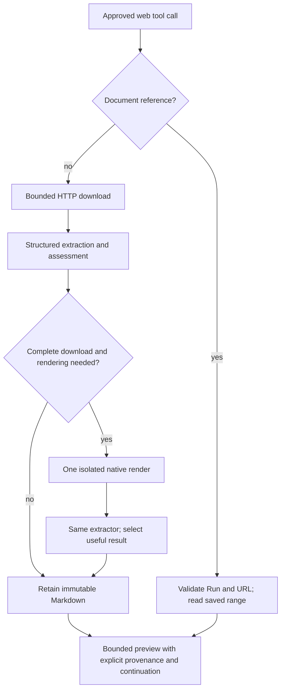

# Web extraction and native rendering

Approved scope: direct HTTP retrieval, local structured extraction and assessment, one native WebView fallback when rendering can help, immutable retained documents, and truthful bounded model results. Both `web_fetch` and `web_extract` use this pipeline. No external extraction provider or LLM cleanup is required.

## Responsibilities

- RSS 0/1/2 and Atom are parsed locally with `feed-rs` by both web tools. Feed MIME types are matched case-insensitively with optional charset parameters; generic XML, plain text, and octet-stream responses are also inspected for feed roots. Other XML retains generic text extraction. HTTP charset, BOM, and XML encoding declarations are decoded before parsing. Feeds do not require browser rendering or secondary requests.
- Capability host web transport downloads a bounded decoded response, preserving its prefix on overflow. HTTP errors, unsupported media, cancellation and permission failures remain explicit. Exact-limit EOF is complete; discarded bytes indicate truncation. A download cap never grants permission to fetch more using a browser.
- The local extractor uses a maintained Readability implementation for article pages and structured Markdown conversion for general pages. It preserves headings, links, lists, tables and code. It assesses usable content, JavaScript shells and empty extraction using several signals; short legitimate pages and headline collections are valid. Assessment never claims semantic completeness.
- The web runtime starts with HTTP and invokes the optional renderer at most once when assessment says rendering is needed and the download is complete. It reruns the same extractor on rendered HTML, retains the better useful candidate, and records fallback failures without discarding useful text. Cancellation always propagates.
- The native renderer is a Rust-owned Tauri adapter injected at desktop composition. It creates a dedicated hidden WebView with separate ephemeral browsing data, no app IPC capabilities, no popups or downloads, and restricted top-level navigation. It waits for document/content readiness under a deadline, captures bounded HTML through native evaluation callbacks, and closes the WebView on every terminal path. Render concurrency is bounded. A WebView is not an OS network sandbox: its subresource traffic is distinct from the HTTP body budget.
- A runtime-owned document repository uses the existing local artifact store for immutable extracted Markdown. Internal artifact receipts are not a second Chat transcript. References bind the document to its originating Run and URL, survive restart, and never accept filesystem paths from the model. Storage failures preserve usable inline results with an explicit unavailable-continuation warning.
- Tool formatting exposes retrieval method, assessment, source incompleteness, retained-text incompleteness, preview truncation, byte counts, source/final URL and fetch time. Model-facing output limits include metadata and continuation instructions. Saved-document reads use the existing web tools with a document ID and UTF-8 byte offset, enforce the Run/URL binding, and perform no network request. The tool result and UI summary say partial content when appropriate; actual failures show their specific cause.

## Data and control flow

## Limits and failure semantics

Feeds default to a compact Markdown listing: feed title/site/update time, entry count, and entry titles, article URLs, dates, and authors in feed order. Descriptions, article bodies, media, and raw XML are omitted. The optional tool argument `feedContent: "full"` includes readable article text (or its summary when the feed supplies no body), converts HTML/XHTML to Markdown, and removes scripts, embeds, and images. Only HTTP(S) links without embedded credentials are emitted. A full-content request cannot invent article text absent from the feed; the model can follow an entry's article URL using ordinary extraction.

For example, `web_fetch({"url":"https://example.com/feed/"})` returns metadata; `web_extract({"urls":["https://example.com/feed/"],"feedContent":"full"})` requests bodies. Both respect the existing inline and download budgets. `metadata.feed` reports format, parsed entry count, content mode, and incomplete-source evidence; a compact `feed` receipt preserves these fields when verbose metadata cannot fit. Downloaded bytes are distinct from model-visible bytes. Saved-document continuation retains the selected content mode and does not refetch; changing modes requires a new URL request without `documentId`.

Feed XML is scanned with bounded element count and nesting before parsing. DTDs are rejected and no external entities are resolved. An interrupted or malformed tail retains only complete fields and entries before the break, with an explicit warning and incompleteness flag. No recoverable feed yields a specific parse error. Oversized title/author fields are shortened to 512 UTF-8 bytes with a warning; normal output/continuation limits still apply to large entry collections and article bodies.

The configured download allowance is separate from the inline text budget. The host supports up to 8 MiB of decoded HTTP input; existing persisted limits remain valid. Retained Markdown and rendered DOM have independent finite ceilings, and all reductions carry explicit flags. A browser timeout may yield a usable but unsettled snapshot; an unavailable renderer yields the original partial result or a specific no-content error. HTTP status errors are never disguised as successful articles. A renderer cannot recover content beyond a frozen download cap. Rendered DOM bytes are reported separately from HTTP download bytes; browser network usage is not invented.

New tool defaults allow 8 MiB downloads and 32 KiB previews. Existing configured byte limits are preserved. `renderWhenNeeded` defaults to true when freezing new tool bindings; historical frozen bindings deserialize with rendering disabled and retain their original serialized representation. The native renderer has one active rendering slot, a 15-second deadline, and an 8 MiB UTF-8 HTML snapshot cap. HTTP requests have a 30-second deadline, and both stages observe the originating Run deadline and user cancellation. Retained documents are bounded at 8 MiB each and 512 MiB across the profile; quota or disk failures disable continuation for that result without erasing its inline content. Existing references are not silently evicted.

At very small model budgets, compact receipts omit verbose titles, URLs, and warning details while explicitly marking that omission and preserving completeness flags, source method, fetch time, and continuation. Multi-page calls leave URLs unrequested once another receipt cannot fit, returning their input indices for a later call. Every actual retrieval still settles independently. `char_limit` remains accepted for compatibility but means UTF-8 bytes. The single-page tool keeps its `text` output field; multi-page results use `content`.

Each rendered page has its own cancellable lifecycle and no access to credentials, the main UI, or privileged commands. Navigation and callback responses are correlated to the active render; late callbacks cannot complete another operation. Website text and script results remain untrusted data. External URLs cannot navigate into local app origins or filesystem schemes. Platform support and native behavior must be verified against the actual embedded engine.

## Verification

Behavior tests cover oversized declared and chunked responses, exact-limit EOF, UTF-8 boundaries, article/general-page fidelity, short valid content, script shells, no render for truncation, one fallback, candidate preservation, cancellation, per-page failures, storage failure, Run/URL reference isolation, restart reads, output notices surviving aggregate truncation, and specific error summaries. Native QA must render a local deterministic JavaScript fixture through the production Tauri adapter, prove content absent from direct HTML becomes available, verify cleanup/cancellation and IPC isolation, and exercise the production extraction/document pipeline. Rebuild the frontend before the desktop executable and inspect the real WebView for UI changes.

Feed regressions cover RSS/Atom/RDF, namespaced authors, relative links and XML base URLs, HTML/XHTML article bodies, metadata-only defaults, malformed/truncated recovery, empty feeds, unsafe XML/links, and budgeted desktop tool receipts with saved continuation for both content modes. The opt-in `host_network` integration test `live_host_python_and_web_tools_can_read_rss` exercises native Host Python HTTPS and both production web entry points against Road to VR; set `AWORKIT_PYTHON_EXECUTABLE` to the host interpreter path before running it with `--ignored --nocapture`.

Reproducible checks:

- `cargo test -p aworkit-capability-host web:: --lib`
- `cargo test --manifest-path desktop/src-tauri/Cargo.toml --lib`
- Build `desktop/dist`, then `cargo build --manifest-path desktop/src-tauri/Cargo.toml --bin aworkit-desktop`.
- Debug executable: `aworkit-desktop.exe --web-extraction-qa <absolute-report-path.json>` exercises real hidden WebView2 pages. Its report is the acceptance result.
- From `desktop`: `node scripts/native-web-extraction-settings.mjs` exercises Settings edits and persistence in an isolated hidden native profile and saves a screenshot.
- Optional public regression: `cargo test -p aworkit-capability-host --lib live_spiegel_extracts_with_explicit_completeness -- --ignored --nocapture`.

Windows validation on 2026-09-05: 220 desktop Rust tests, 39 web tests, and 61 configuration/Settings frontend tests passed. The public Spiegel regression returned useful partial text under the historical 1 MiB cap and a complete HTTP response under 8 MiB. Real WebView2 QA covered delayed JavaScript content, structured extraction, app-command isolation, snapshot limits, cancellation, and zero remaining renderer windows or temporary profiles. Native Settings controls and saved values were verified with a screenshot. Other embedded engines have not been validated here. Strict repository Clippy is currently blocked by existing warnings in the surrounding runtime/process code; normal builds and the relevant tests pass.
